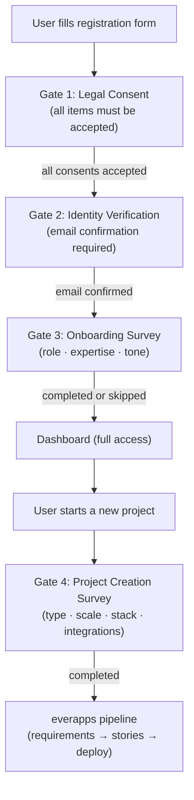
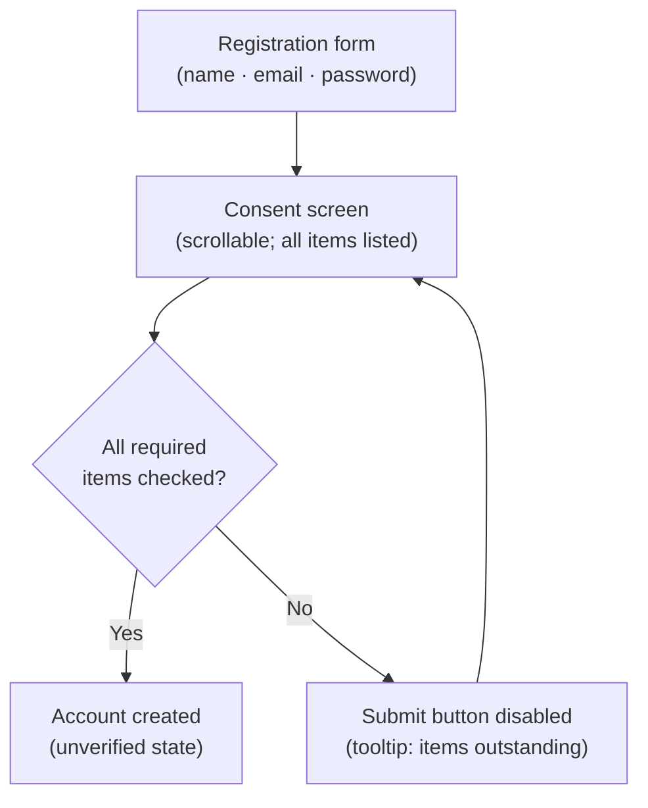
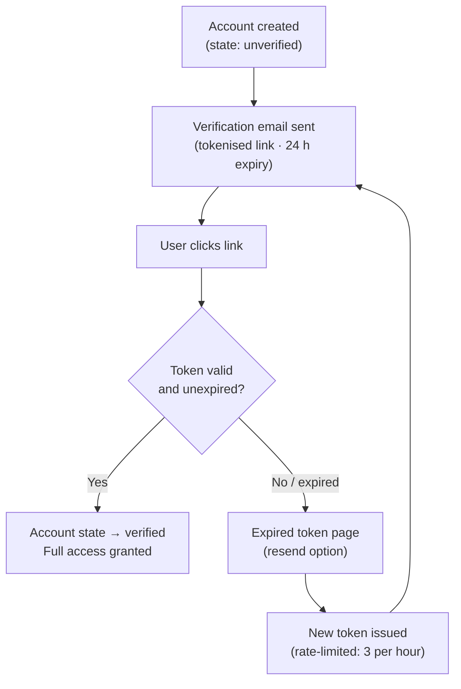
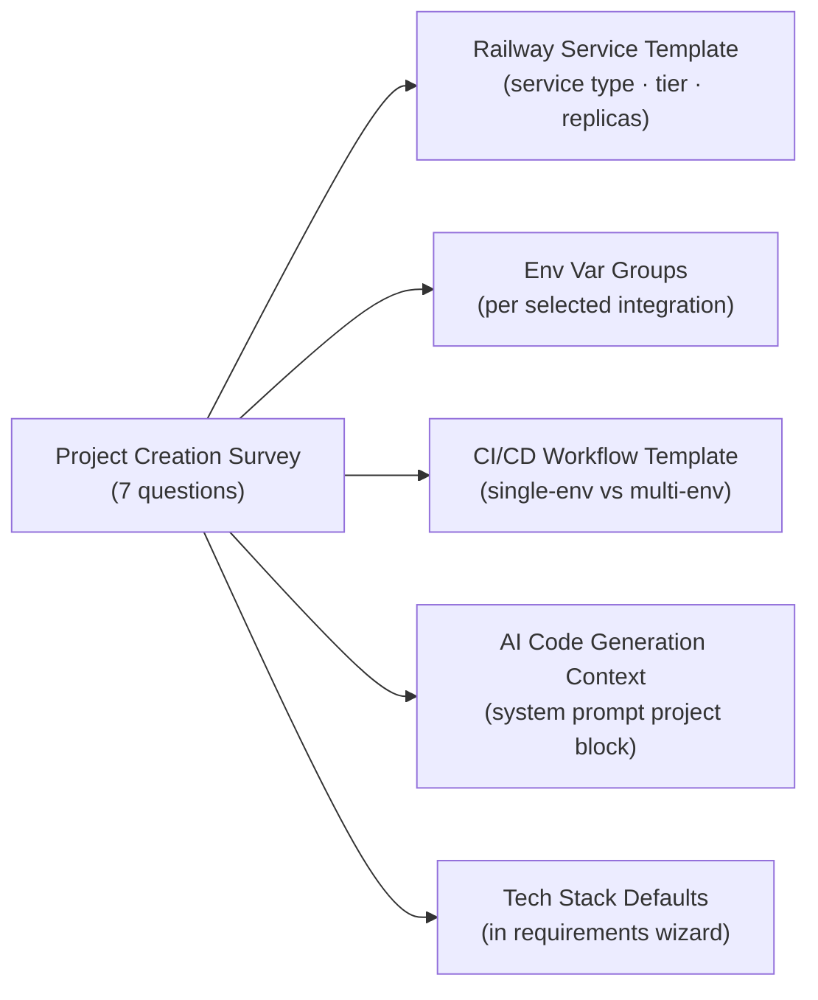
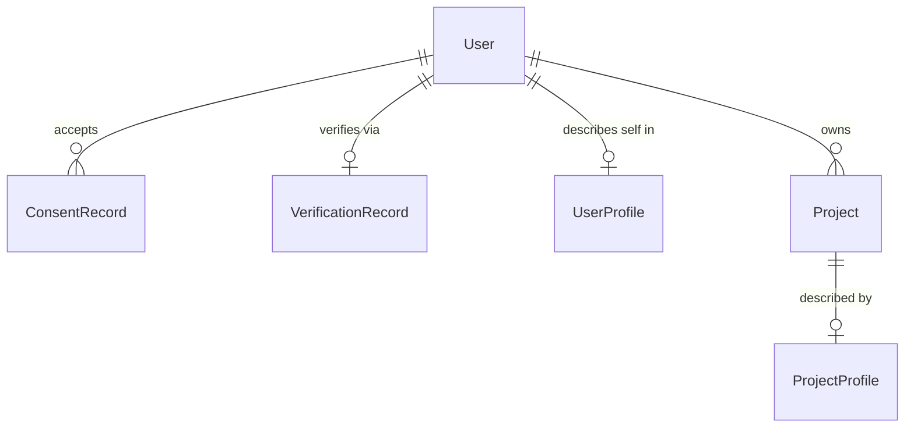

# everapps — Account Creation & Onboarding Enhancements

**Prepared:** March 2026  
**Scope:** Four planned enhancements that establish a secure, legally compliant, and intelligent
account creation and onboarding flow — covering legal consent, identity verification, a user
onboarding survey, and a project creation survey. Together these gates ensure every everapps user
and every project starts from a well-understood, trusted baseline that drives personalised AI
behaviour downstream.

---

## Overview

Account creation and onboarding are the first touchpoints a user has with everapps. The four
enhancements described in this document operate as sequential gates:

1. **Legal Consent** — the user must explicitly accept all required agreements before an account is
   created.
2. **Identity Verification** — at minimum, email ownership is confirmed before the account is
   activated.
3. **Onboarding Survey** — immediately after verification, the user answers a short survey that
   captures role, expertise, and communication preferences to personalise AI behaviour.
4. **Project Creation Survey** — at the start of each new project, a second survey captures
   project-level intent to drive deployment strategy, tech stack selection, and AI context.



All four enhancements introduce new data models, described fully in the
[Data Models Summary](#data-models-summary) section at the end of this document.

---

## Enhancement 1 — Legal Consent & Acceptance

### Purpose

everapps provisions cloud infrastructure on behalf of its users via Railway. This creates a
dual-consent obligation: users must accept everapps' own terms **and** acknowledge the downstream
obligations imposed by Railway's platform. Consent must be versioned and recorded with full
audit detail so that it can be retrieved in response to legal requests or re-surfaced when
documents change.

### Consent Items

The following consent items must all be accepted before account creation proceeds. Each is a
separate, individually tracked record.

| ID | Item | Required | Notes |
|---|---|---|---|
| `tos` | everapps Terms of Service | Yes | Version-tracked; re-consent required on update |
| `privacy` | everapps Privacy Policy | Yes | Version-tracked; re-consent required on update |
| `railway_aup` | Railway Acceptable Use Policy pass-through | Yes | Links to [railway.app/legal/fair-use](https://railway.app/legal/fair-use); user acknowledges their projects are subject to Railway's AUP |
| `railway_tos` | Railway Terms of Service acknowledgement | Yes | Links to [railway.app/legal/terms](https://railway.app/legal/terms); user acknowledges Railway hosts the infrastructure |
| `age` | Age attestation (13+ for personal use; 18+ for commercial use) | Yes | Collected as a checkbox with explicit age band selection |
| `gdpr` | GDPR / CCPA data processing acknowledgement | Conditional | Required when the user's detected or declared jurisdiction is EEA, UK, or California |
| `marketing` | Marketing communications opt-in | No | Optional; unchecked by default |

### Railway Alignment

everapps deploys all generated project infrastructure to Railway. When a user creates a project
in everapps, Railway services, environments, and deployments are provisioned programmatically
using the Railway API. This means:

- All user-generated projects run under Railway's infrastructure terms.
- everapps is responsible for ensuring its users have been informed of and have acknowledged
  the relevant Railway policies before any Railway provisioning occurs.
- The `railway_aup` and `railway_tos` consent items satisfy this requirement. They must be
  displayed with visible links to the current Railway policy pages and must not be pre-checked.

If Railway updates its terms in a way that materially affects user obligations, the
`railway_aup` or `railway_tos` consent versions must be incremented and re-consent triggered
for all existing users before their next Railway-backed provisioning action is allowed.

### UX Flow



- Consent checkboxes are **unchecked by default** for all items, including optional ones.
- The "Create account" submit button is disabled until all required items are checked.
- Each consent item label is a readable description; legal document titles link to the full
  document in a new tab.
- The screen is not a modal — it is a dedicated step in a multi-step registration flow so that
  users cannot accidentally skip it.

### Re-Consent Trigger

When a consent document version is incremented:

1. All `ConsentRecord` rows for that `consent_type` with an older `version` are flagged as
   stale.
2. On the user's next login, a blocking interstitial presents only the updated consent item(s).
3. The user cannot proceed to the dashboard until the updated item is accepted.
4. A new `ConsentRecord` is written; the old record is retained for audit purposes.

### Data Model

```
ConsentRecord
─────────────
id                UUID        PK
user_id           UUID        FK → User
consent_type      VARCHAR     enum: tos | privacy | railway_aup | railway_tos | age | gdpr | marketing
version           VARCHAR     e.g. "2026-03-01"
accepted          BOOLEAN     false = explicitly declined (for optional items)
accepted_at       TIMESTAMP
ip_address        INET
user_agent        TEXT
```

---

## Enhancement 2 — Identity Verification on Registration

### Purpose

Confirming that a user controls the contact method they registered with reduces fraudulent
account creation, ensures recovery paths are valid, and gates access to Railway-backed
provisioning behind a verified identity.

### Verification Tiers

Verification is tiered. Tier 1 is mandatory for all users. Higher tiers are opt-in or
conditionally required.

| Tier | Trigger | Method | Provider |
|---|---|---|---|
| **Tier 1** | All users at registration | Email tokenised link | Internal (everapps sends via transactional email service) |
| **Tier 2** | User opts in, or required for elevated-trust actions (e.g. enterprise SSO, API key issuance) | SMS OTP or TOTP authenticator app | Internal SMS gateway (e.g. Twilio) or TOTP (RFC 6238) |
| **Tier 3** | Future / enterprise plan | Document-based identity verification | Third-party provider (e.g. Stripe Identity, Persona) |

### Tier 1 — Email Verification Flow



- The verification token is a cryptographically random 32-byte value stored as a hash; the
  plaintext is sent only in the email link and is never logged.
- Tokens expire after 24 hours.
- Resend is rate-limited to 3 requests per hour per account to prevent email flooding.
- Until Tier 1 is complete, the account is in **unverified** state: the user can log in but
  is limited to read-only access and cannot trigger any Railway provisioning.

### Unverified Account Restrictions

| Action | Unverified | Tier 1 Verified | Tier 2 Verified |
|---|---|---|---|
| View dashboard | Read-only | Full access | Full access |
| Create a project | Blocked | Allowed | Allowed |
| Run AI story generation | Blocked | Allowed | Allowed |
| Provision Railway service | Blocked | Allowed | Allowed |
| Issue API key | Blocked | Blocked | Allowed |
| Enterprise SSO configuration | Blocked | Blocked | Allowed |

### Fraud & Abuse Signals

The following signals are evaluated at registration time and may result in a registration being
rate-limited, flagged for review, or silently deferred:

- **IP rate limiting:** no more than 5 new accounts per IP address per hour.
- **Disposable email detection:** registrations using known disposable email domains are
  flagged; the user is warned and encouraged to use a permanent address, but registration is
  not blocked outright (false positives exist for some corporate domains).
- **Username / email enumeration protection:** the registration response is identical whether
  or not the email already exists; a separate "forgot password" flow handles the duplicate
  case.
- **Bot detection:** a lightweight honeypot field and timing check on the registration form;
  CAPTCHA is a fallback for repeated failures from the same IP.

### Data Model

```
VerificationRecord
──────────────────
id                UUID        PK
user_id           UUID        FK → User
tier              INTEGER     1 | 2 | 3
method            VARCHAR     email_link | sms_otp | totp | document
verified_at       TIMESTAMP   null until verified
provider          VARCHAR     internal | twilio | stripe_identity | persona | null
provider_ref      VARCHAR     external reference ID from third-party provider (nullable)
token_hash        VARCHAR     bcrypt / sha256 hash of the token; null after verification
token_expires_at  TIMESTAMP   null after verification
```

---

## Enhancement 3 — Onboarding Survey

### Purpose

A five-question survey presented immediately after email verification captures who the user is,
what they intend to build, and how they prefer to interact with the AI. Answers are stored as
a `UserProfile` extension and used throughout the application to:

- Adjust the verbosity and technical depth of all AI-generated text (prompts, explanations,
  suggestions).
- Set default tech stack recommendations in the Project Creation Survey.
- Calibrate wizard step complexity — beginners see more guidance, experts see denser
  interfaces.

### Survey Presentation

- Displayed as a dedicated full-screen step immediately after Tier 1 verification is
  confirmed (either on the verification landing page or the first post-login view if
  verification was completed out of session).
- A "Skip for now" option is available; defaults are applied automatically for any unanswered
  questions (documented below).
- The survey can be revisited and edited at any time from **Account Settings → Profile**.
- Re-answering the survey does not require re-verification; changes take effect immediately.

### Questions

#### Q1 — Role

> "Which best describes your role?"

| Value | Label | Default AI tone | Default stack |
|---|---|---|---|
| `solo_dev` | Solo developer | Concise & technical | Python / FastAPI |
| `tech_lead` | Technical lead | Concise & technical | Let AI decide |
| `product_manager` | Product manager | Guided & explanatory | Let AI decide |
| `business_analyst` | Business analyst | Guided & explanatory | Let AI decide |
| `nontechnical_founder` | Non-technical founder | Guided & explanatory | Let AI decide |
| `other` | Other | Guided & explanatory | Let AI decide |

#### Q2 — Intended Use

> "How do you plan to use everapps?"

| Value | Label |
|---|---|
| `personal` | Personal project or side project |
| `small_team` | Small team (2–10 people) |
| `enterprise` | Enterprise or agency |
| `learning` | Learning or exploration |

#### Q3 — Technical Level

> "How would you rate your software development experience?"

| Value | Label | UI complexity level |
|---|---|---|
| `beginner` | Beginner — I'm new to coding | High guidance; tooltips on all controls |
| `intermediate` | Intermediate — I build things but sometimes need help | Standard UI |
| `advanced` | Advanced — I'm comfortable with full-stack development | Compact UI; advanced options visible |
| `expert` | Expert — I write production systems professionally | Compact UI; all options exposed by default |

#### Q4 — Preferred AI Tone

> "How would you like the AI to communicate with you?"

| Value | Label | System prompt modifier |
|---|---|---|
| `technical` | Concise & technical — minimal explanation, precise language | "Be terse. Use technical terminology without defining it. Omit preamble." |
| `guided` | Guided & explanatory — walk me through decisions | "Explain each decision. Define technical terms on first use. Use numbered steps." |
| `conversational` | Collaborative & conversational — think out loud with me | "Use a collaborative tone. Present trade-offs and ask clarifying questions before acting." |

#### Q5 — Primary Domain

> "What type of software are you most likely to build?"

| Value | Label |
|---|---|
| `web_app` | Web application (full-stack) |
| `api_backend` | API or backend service |
| `data_ml` | Data pipeline or machine learning |
| `mobile_backend` | Mobile app backend |
| `internal_tooling` | Internal tooling or automation |
| `other` | Other |

### Skip Defaults

If the user skips the survey, the following defaults are applied:

| Field | Default value |
|---|---|
| `role` | `other` |
| `intended_use` | `personal` |
| `tech_level` | `intermediate` |
| `ai_tone_preference` | `guided` |
| `primary_domain` | `web_app` |

### Downstream Effects

| Survey Answer | System Behaviour Affected |
|---|---|
| `tech_level: beginner` | Wizard shows inline explanations for all technical terms; advanced options collapsed by default |
| `tech_level: expert` | All advanced options visible by default; step completion descriptions omitted |
| `ai_tone_preference: technical` | All AI-generated narrative text uses the "terse / technical" system prompt modifier |
| `ai_tone_preference: guided` | All AI-generated narrative text uses the "guided / explanatory" modifier |
| `ai_tone_preference: conversational` | AI presents trade-offs and asks clarifying questions before generating output |
| `role: nontechnical_founder` | Project Creation Survey defaults to "Let AI decide" for stack; technical implementation sections in wizard are summarised rather than detailed |
| `primary_domain: data_ml` | Project Creation Survey defaults to Python; database options emphasise PostgreSQL + Redis |
| `intended_use: enterprise` | Project Creation Survey enables SSO, multi-environment, and custom domain questions by default |

### Data Model

Extension fields added to the existing `User` or a linked `UserProfile` table:

```
UserProfile (extension / linked table)
───────────────────────────────────────
id                    UUID        PK
user_id               UUID        FK → User (unique)
role                  VARCHAR     enum: solo_dev | tech_lead | product_manager | business_analyst | nontechnical_founder | other
intended_use          VARCHAR     enum: personal | small_team | enterprise | learning
tech_level            VARCHAR     enum: beginner | intermediate | advanced | expert
ai_tone_preference    VARCHAR     enum: technical | guided | conversational
primary_domain        VARCHAR     enum: web_app | api_backend | data_ml | mobile_backend | internal_tooling | other
survey_completed_at   TIMESTAMP   null if skipped
survey_skipped        BOOLEAN     true if user clicked "Skip for now"
survey_version        VARCHAR     version of the survey questions answered (for future survey schema changes)
```

---

## Enhancement 4 — Project Creation Survey

### Purpose

Every new project in everapps goes through a brief survey before the requirements wizard begins.
This survey captures the intent, scale, technical preferences, and integration needs of the
specific project. The answers feed directly into:

- **Railway service templates** — which service configurations are pre-populated when the
  project is provisioned.
- **Environment variable scaffolding** — which env var groups are created by default.
- **CI/CD workflow selection** — which GitHub Actions workflow template is committed to the
  project repo.
- **AI code generation context** — the system prompt context window for all story-level code
  generation tasks includes the project profile as structured context.
- **Tech stack defaults** — pre-selects language, framework, and database recommendations in
  the requirements wizard.

### Survey Presentation

- Presented as the first step of the "New Project" flow, before the requirements wizard or
  document upload screen.
- Required — cannot be skipped. If a user exits mid-survey, the project is not created and
  the survey resumes on re-entry.
- Can be edited after project creation via **Project Settings → Project Profile**. Changes to
  the survey after initial Railway provisioning may require manual infrastructure adjustments
  (a warning is shown).

### Questions

#### Q1 — Project Type

> "What are you building?"

| Value | Label | Railway template hint |
|---|---|---|
| `web_fullstack` | Web application (full-stack, frontend + backend) | Web service + static site service |
| `api_only` | REST or GraphQL API (backend only) | Web service only |
| `static_site` | Static site or JAMstack | Static site service |
| `background_worker` | Background worker or scheduled job (cron) | Worker service |
| `data_pipeline` | Data pipeline or ML workload | Worker service + volume mount |

#### Q2 — Expected Scale

> "What is the expected usage scale for this project?"

| Value | Label | Railway sizing hint |
|---|---|---|
| `prototype` | Prototype or personal use | Hobby tier; single replica |
| `small_team` | Small team (up to ~1,000 requests/day) | Starter tier; single replica |
| `production` | Production app (100 – 10,000 active users) | Pro tier; single replica + autoscale |
| `high_scale` | High scale (10,000+ users or high throughput) | Pro tier; multi-replica + autoscale + CDN |

#### Q3 — Language & Framework Preference

> "Do you have a preferred language or framework?"

| Value | Label |
|---|---|
| `ai_decide` | Let the AI recommend based on my project |
| `python_fastapi` | Python / FastAPI |
| `python_django` | Python / Django |
| `node_express` | Node.js / Express |
| `node_nextjs` | Node.js / Next.js |
| `node_nestjs` | Node.js / NestJS |
| `go` | Go |
| `ruby_rails` | Ruby on Rails |
| `other` | Other (free-text field) |

When `ai_decide` is selected, the AI derives a recommendation from the project type, scale,
and the user's `primary_domain` from the Onboarding Survey. The recommendation is shown to
the user before the requirements wizard begins and can be overridden.

#### Q4 — Database

> "What database does this project need?"

Multi-select allowed.

| Value | Label | Railway add-on |
|---|---|---|
| `none` | No database | — |
| `postgresql` | PostgreSQL | Railway PostgreSQL plugin |
| `mysql` | MySQL | Railway MySQL plugin |
| `mongodb` | MongoDB | External (Atlas) or Docker service |
| `redis` | Redis (cache or queue) | Railway Redis plugin |
| `sqlite` | SQLite (local / prototype only) | Volume mount |

#### Q5 — Authentication

> "What authentication does this project need?"

| Value | Label | Scaffolding implication |
|---|---|---|
| `none` | No authentication | No auth boilerplate generated |
| `email_password` | Email and password | Local auth; bcrypt; JWT or session tokens |
| `oauth_social` | OAuth (social login: Google, GitHub, etc.) | OAuth2 callback boilerplate; provider config env vars |
| `sso_saml` | SSO / SAML (enterprise identity provider) | SAML library scaffolded; Tier 2 verification required |
| `magic_link` | Magic link (passwordless email) | Token-based auth flow |

#### Q6 — Third-Party Integrations

> "Which integrations does this project need?"

Multi-select allowed.

| Value | Label | Env vars scaffolded |
|---|---|---|
| `stripe` | Stripe (payments) | `STRIPE_SECRET_KEY`, `STRIPE_WEBHOOK_SECRET` |
| `sendgrid` | SendGrid (transactional email) | `SENDGRID_API_KEY`, `FROM_EMAIL` |
| `ses` | Amazon SES (transactional email) | `AWS_ACCESS_KEY_ID`, `AWS_SECRET_ACCESS_KEY`, `SES_REGION` |
| `s3` | S3-compatible object storage | `S3_BUCKET`, `S3_REGION`, `AWS_ACCESS_KEY_ID`, `AWS_SECRET_ACCESS_KEY` |
| `twilio` | Twilio (SMS) | `TWILIO_ACCOUNT_SID`, `TWILIO_AUTH_TOKEN`, `TWILIO_FROM_NUMBER` |
| `pusher` | Pusher / Ably (real-time websockets) | `PUSHER_APP_ID`, `PUSHER_KEY`, `PUSHER_SECRET` |
| `openai` | OpenAI API | `OPENAI_API_KEY` |
| `none` | None | — |

#### Q7 — Deployment Configuration

> "How do you want to deploy this project?"

| Value | Label | Effect |
|---|---|---|
| `railway_default` | Railway — standard (default) | Single Railway project; `production` environment only |
| `railway_multienvironment` | Railway — multi-environment (dev / staging / production) | Three Railway environments provisioned; GitHub branch-based promotion wired |
| `custom_domain` | Custom domain | Custom domain configuration step added to post-deploy checklist |
| `custom_domain_multi` | Custom domain + multi-environment | Both of the above |

### Downstream Mapping

The full mapping from survey answers to system outputs:



| Survey Answer | Railway Template | Env Vars | CI/CD Template | AI Context | Stack Default |
|---|---|---|---|---|---|
| `project_type: web_fullstack` | Web + static service | — | Web deploy | Included | Framework per Q3 |
| `project_type: background_worker` | Worker service | — | Worker deploy | Included | — |
| `scale: prototype` | Hobby tier | — | — | Included | SQLite default for DB |
| `scale: high_scale` | Pro tier; autoscale | — | Multi-replica config | Included | PostgreSQL required |
| `database: postgresql` | PostgreSQL plugin | `DATABASE_URL` | Migration step | Included | ORM scaffolded |
| `auth: oauth_social` | — | OAuth provider keys | — | Included | OAuth2 library scaffolded |
| `integration: stripe` | — | Stripe keys | Webhook endpoint | Included | Stripe SDK scaffolded |
| `deployment: railway_multienvironment` | 3 environments | Per-environment vars | Branch promotion | — | — |

### Data Model

```
ProjectProfile
──────────────
id                  UUID        PK
project_id          UUID        FK → Project (unique)
project_type        VARCHAR     enum: web_fullstack | api_only | static_site | background_worker | data_pipeline
expected_scale      VARCHAR     enum: prototype | small_team | production | high_scale
language_framework  VARCHAR     enum: ai_decide | python_fastapi | python_django | node_express | node_nextjs | node_nestjs | go | ruby_rails | other
language_other      VARCHAR     free text; only populated when language_framework = other
databases           VARCHAR[]   array of enum values; see Q4
auth_type           VARCHAR     enum: none | email_password | oauth_social | sso_saml | magic_link
integrations        VARCHAR[]   array of enum values; see Q6
deployment_config   VARCHAR     enum: railway_default | railway_multienvironment | custom_domain | custom_domain_multi
survey_version      VARCHAR     version of the survey questions answered
completed_at        TIMESTAMP
```

---

## Data Models Summary

All new models introduced across the four enhancements:

| Model | Enhancement | Purpose |
|---|---|---|
| `ConsentRecord` | 1 — Legal Consent | One row per user per consent item accepted; versioned and audit-safe |
| `VerificationRecord` | 2 — Identity Verification | Tracks verification tier, method, and provider per user |
| `UserProfile` | 3 — Onboarding Survey | Stores user's role, expertise, and AI tone preferences |
| `ProjectProfile` | 4 — Project Creation Survey | Stores project type, scale, stack, and integration selections |

### Key Relationships



---

## Open Decisions

| # | Decision | What it blocks | Notes |
|---|---|---|---|
| 1 | **Consent document versioning strategy** | Re-consent trigger implementation | How are version strings managed — date-based (e.g. `2026-03-01`) vs semantic (e.g. `v2.1`)? Who is responsible for incrementing versions and what tooling enforces re-consent rollout? |
| 2 | **Tier 2 verification provider** | `VerificationRecord.provider` for SMS OTP | Choice between Twilio, AWS SNS, Vonage, or a Railway-hosted gateway. TOTP (RFC 6238) is provider-independent and may be preferable for avoiding SMS costs. |
| 3 | **Tier 3 identity verification provider** | Enterprise plan gating | Stripe Identity and Persona are the leading candidates. Decision depends on pricing model and whether everapps will require ID verification at launch or defer it entirely to a later enterprise tier. |
| 4 | **Survey skip policy for enterprise SSO users** | Onboarding Survey default application | Users who register via an enterprise SSO integration may have role and domain data available from the identity provider (e.g. SCIM attributes). Should SSO user attributes pre-populate the Onboarding Survey automatically, bypassing the survey UI? |
| 5 | **Project Creation Survey editability post-provisioning** | Infrastructure drift warning UX | If a user changes `database` or `deployment_config` after Railway services have already been provisioned, everapps cannot automatically reconcile the infrastructure. Decide whether to block edits to provisioning-relevant fields, warn and allow, or fully block and require a new project. |
| 6 | **GDPR / CCPA jurisdiction detection** | `gdpr` consent item display logic | Jurisdiction can be inferred from IP geolocation or asked explicitly. Explicit declaration is more reliable but adds friction. IP-based detection is automatic but inaccurate for VPN users. |
