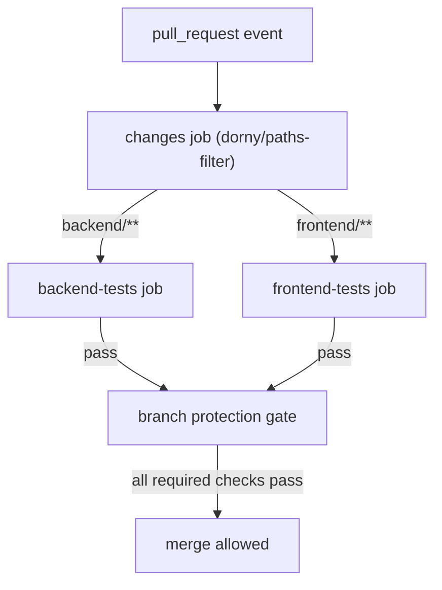

# CI/CD Pipeline Strategy

## Overview

This document defines the CI/CD pipeline rules for this project. The guiding principle is:

> **Test at the gate. Promote with confidence.**

The PR into `develop` is the single CI gate. All other events — promotions from `develop → staging → main` — carry identical, already-tested code and require no retesting.

This strategy is designed to work alongside the branching model described in [`git-branching-strategy.md`](./git-branching-strategy.md).

---

## The Problem with Naive CI Configuration

Without intentional trigger design, a single feature will trigger 10 job runs:

| Event | Workflow | Jobs run |
|-------|----------|----------|
| push to `feature/x` (per commit) | `feature-branch-tests.yml` | backend + frontend |
| open PR into `develop` | `ci.yml` (pull_request) | backend + frontend |
| PR merged → push to `develop` | `ci.yml` (push) | backend + frontend — **duplicate** |
| ff-only push to `staging` | `ci.yml` (push) | backend + frontend — **duplicate** |
| ff-only push to `main` | `ci.yml` (push) | backend + frontend — **duplicate** |

Runs 3–5 are byte-for-byte the same code that already passed run 2. There is also no path filtering, so a CSS-only change triggers the entire Python test suite.

---

## Optimized Trigger Rules

### Where CI runs

| Event | CI runs? | Reason |
|-------|----------|--------|
| push to a feature branch | No | Noisy; PR is the real gate |
| open / update PR into `develop` | **Yes — full suite** | This is the merge gate |
| open / update PR into `staging` | Yes — path-filtered | Same code; passes quickly via cache |
| open / update PR into `main` | Yes — path-filtered | Same code; passes quickly via cache |
| push to `develop` after merge | No | Already passed on the PR |
| push to `staging` after promotion | No | Already passed; Railway deploys immediately |
| push to `main` after promotion | No | Already passed; Railway deploys immediately |

### Why promotion PRs still trigger CI

Promotion PRs (`develop → staging`, `staging → main`) carry no new code, so tests always pass quickly (especially with dependency caching). Having CI run on them keeps GitHub's required-check UI happy and provides a visible audit trail, while still being cheap to run.

---

## Path Filtering

Tests are split by service so only the affected stack runs:

| Files changed | Backend tests | Frontend tests |
|---------------|--------------|----------------|
| `backend/**` only | Yes | No |
| `frontend/**` only | No | Yes |
| Both | Yes | Yes |
| Neither (e.g. docs, config) | No | No |

A `changes` job runs first to detect which paths were touched, and each test job only starts if its path matches.

---

## Workflow Architecture



---

## Railway Configuration

### Remove "Wait for CI" on branch deploys

Railway should **not** wait for CI on pushes to `develop`, `staging`, or `main`. There is no CI running on those push events — it was already enforced on the PR before the merge.

In the Railway dashboard, for **each environment**:

1. Navigate to **Settings → Source**
2. Disable **"Wait for CI checks before deploying"** (or equivalent toggle)

Railway will then deploy immediately when a branch is updated. This is safe because GitHub branch protection already guarantees that no code reaches any of the three branches without passing CI.

### Deploy trigger

Railway is connected to each branch and deploys on every push:

| Branch | Railway Environment | Deploys when |
|--------|---------------------|--------------|
| `develop` | Development | PR is merged into `develop` |
| `staging` | Staging | Promotion PR is merged into `staging` |
| `main` | Production | Promotion PR is merged into `main` |

---

## GitHub Branch Protection Settings

### `develop`

- Require pull requests before merging
- Require status checks to pass:
  - `Backend Tests` (when backend files changed)
  - `Frontend Tests` (when frontend files changed)
- Require branches to be up to date before merging
- Do not allow bypassing these settings

### `staging` and `main`

- Require pull requests before merging
- No required CI status checks (promotions carry no new code)
- Require linear history
- Do not allow bypassing these settings

> **Note on "no required CI" for staging/main:** Because promotions are ff-only merges of already-tested code, requiring CI on these branches would add latency with no security benefit. The branch protection on `develop` is where the guarantee is established.

---

## Workflow Files

### `.github/workflows/ci.yml`

This is the only workflow file. `feature-branch-tests.yml` is deleted.

```yaml
name: CI

on:
  pull_request:
    branches: [develop, staging, main]

jobs:
  changes:
    name: Detect Changed Paths
    runs-on: ubuntu-latest
    outputs:
      backend: ${{ steps.filter.outputs.backend }}
      frontend: ${{ steps.filter.outputs.frontend }}
    steps:
      - uses: actions/checkout@v4
      - uses: dorny/paths-filter@v3
        id: filter
        with:
          filters: |
            backend:
              - 'backend/**'
            frontend:
              - 'frontend/**'

  backend-tests:
    name: Backend Tests
    needs: changes
    if: needs.changes.outputs.backend == 'true'
    runs-on: ubuntu-latest
    steps:
      - uses: actions/checkout@v4
      - uses: actions/setup-python@v5
        with:
          python-version: "3.12"
          cache: "pip"
          cache-dependency-path: backend/requirements.txt
      - name: Install dependencies
        run: pip install -r requirements.txt
        working-directory: backend
      - name: Run pytest
        run: pytest
        working-directory: backend
        env:
          UPLOAD_DIR: /tmp/everapps_test_uploads

  frontend-tests:
    name: Frontend Tests
    needs: changes
    if: needs.changes.outputs.frontend == 'true'
    runs-on: ubuntu-latest
    steps:
      - uses: actions/checkout@v4
      - uses: actions/setup-node@v4
        with:
          node-version: "20"
          cache: "npm"
          cache-dependency-path: frontend/package-lock.json
      - name: Install dependencies
        run: npm ci
        working-directory: frontend
      - name: Lint
        run: npm run lint
        working-directory: frontend
      - name: Run tests
        run: npm test -- --ci --coverage --passWithNoTests
        working-directory: frontend
        env:
          NEXT_PUBLIC_API_URL: http://localhost:8000/api/v1
```

---

## Result: Test Runs Per Feature

| Event | Before | After |
|-------|--------|-------|
| push to feature branch (per commit) | 2 jobs | 0 |
| open PR into `develop` | 2 jobs | 1–2 (path-filtered) |
| push to `develop` after merge | 2 jobs | 0 |
| push to `staging` after promotion | 2 jobs | 0 |
| push to `main` after promotion | 2 jobs | 0 |
| **Total per feature** | **10 job runs** | **1–2 job runs** |

---

## Promotion Workflows

Instead of running git commands manually to promote between environments, two `workflow_dispatch` workflows act as one-click promotion buttons in the GitHub Actions UI.

### Workflows

| Workflow | File | Trigger |
|----------|------|---------|
| Promote develop → staging | `.github/workflows/promote-develop-to-staging.yml` | Manual button |
| Promote staging → main | `.github/workflows/promote-staging-to-main.yml` | Manual button + version input |

### How to trigger a promotion

1. Go to **GitHub → Actions** tab
2. Select the promotion workflow from the left sidebar
3. Click **Run workflow**
4. For `staging → main`: enter the version tag (e.g. `v1.2.0`) in the input field
5. Click **Run workflow**

Both workflows run a pre-flight check before pushing. If the fast-forward is not possible (branches have diverged), the workflow fails with a clear error message and instructions for investigating. Nothing is pushed.

The `staging → main` workflow also creates an annotated git tag and a GitHub Release with auto-generated notes.

### One-time setup: GH_PAT secret

The workflows push directly to protected branches, which requires a Personal Access Token (PAT) with write access. `GITHUB_TOKEN` cannot bypass branch protection rules.

**Steps to create and configure the PAT:**

1. Go to **GitHub → Settings → Developer Settings → Personal access tokens → Fine-grained tokens**
2. Click **Generate new token**
3. Set:
   - **Resource owner:** `evertheme`
   - **Repository access:** `evertheme/everapps` only
   - **Permissions → Contents:** `Read and Write`
   - **Permissions → Pull requests:** `Read and Write` (needed for `gh release create`)
4. Copy the generated token
5. Go to **GitHub → evertheme/everapps → Settings → Secrets and variables → Actions**
6. Click **New repository secret**
7. Name: `GH_PAT`, Value: paste the token
8. Click **Add secret**

---

## Edge Cases

### PR that only changes docs or config

If a PR changes only files outside `backend/` and `frontend/` (e.g. `docs/`, `.env.example`, `docker-compose.yml`), neither test job will run. The PR can still be merged because no required status checks are triggered.

If you want to block merges on doc-only PRs without tests, add a catch-all job:

```yaml
  no-tests-needed:
    name: No Tests Required
    needs: changes
    if: needs.changes.outputs.backend == 'false' && needs.changes.outputs.frontend == 'false'
    runs-on: ubuntu-latest
    steps:
      - run: echo "No testable files changed."
```

Then add `No Tests Required` as an optional (not required) status check in branch protection.

### Hotfix PRs

Hotfix branches target `main` directly. The PR into `main` triggers CI on `backend/**` and/or `frontend/**` as normal. After merging and back-propagating (`main → staging → develop`), no additional CI runs — same code.

---

## Release Tagging

### How versioning works

All release workflows use **auto-increment versioning** — you select the bump type and the workflow reads the latest git tag, calculates the next version, and creates it for you. No manual version entry required.

| Bump type | Example: last tag `v1.2.3` | Result |
|-----------|---------------------------|--------|
| `patch` | bug fixes, hotfixes | `v1.2.4` |
| `minor` | new backward-compatible features | `v1.3.0` |
| `major` | breaking changes, major milestones | `v2.0.0` |

If no tags exist yet, versioning starts from `v0.0.0`.

### Release notes categories

`.github/release.yml` configures how GitHub groups PRs in the auto-generated release notes. Apply one of these labels to each PR before merging:

| Label | Release notes section |
|-------|-----------------------|
| `feature`, `enhancement` | New Features |
| `bug`, `fix` | Bug Fixes |
| `performance` | Performance |
| `chore`, `dependencies`, `ci` | Chores & Maintenance |
| `documentation` | Documentation |

PRs without a matching label appear under "Other Changes."

### Standalone `Create Release` workflow

A dedicated `Create Release` workflow exists for cases where a release needs to be created independently of a promotion — most commonly after a **hotfix** is merged directly to `main`.

**To trigger:** GitHub → Actions → **Create Release** → Run workflow

| Input | Description |
|-------|-------------|
| `bump` | `patch`, `minor`, or `major` |
| `branch` | Branch or commit to tag (default: `main`) |
| `prerelease` | Check to mark as pre-release |

The workflow calculates the next version, creates an annotated tag on the specified branch, and publishes a GitHub Release with categorized notes.

### `Promote staging → main` workflow

The promotion workflow also handles tagging. After the fast-forward push to `main`, it runs the same auto-increment logic and creates the release in one step.

**To trigger:** GitHub → Actions → **Promote staging → main** → Run workflow → select bump type

This is the standard release path. Use `Create Release` only for hotfixes or exceptional cases.
