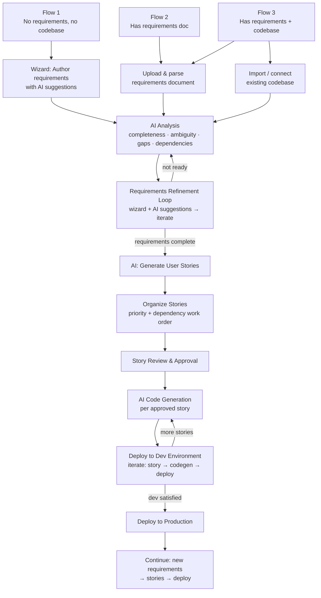
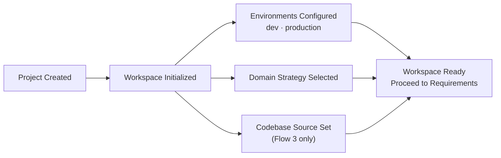
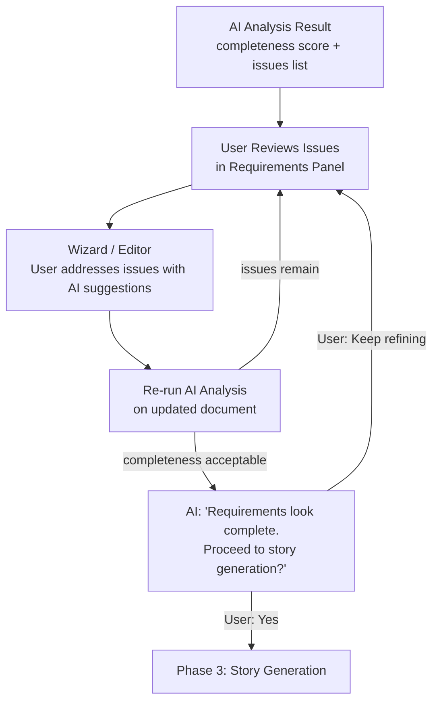
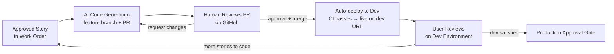
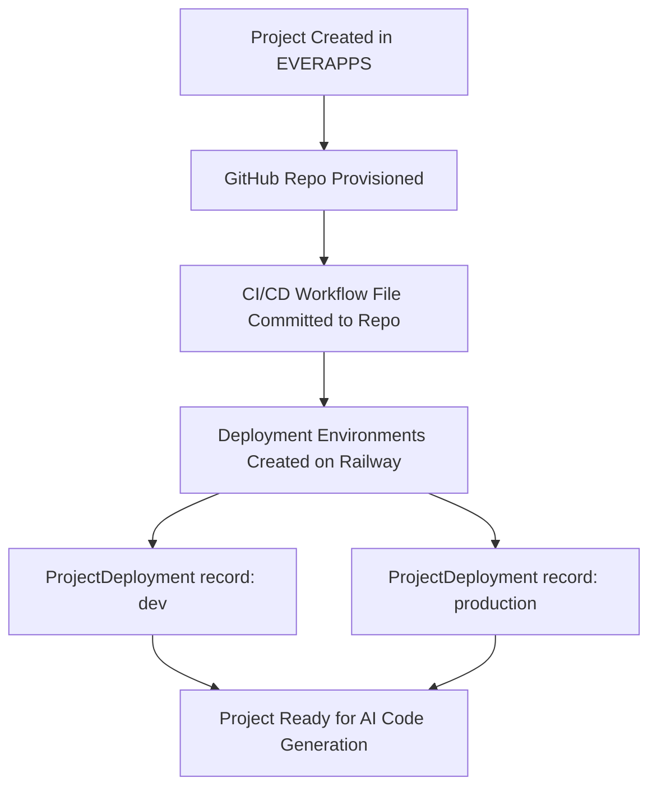
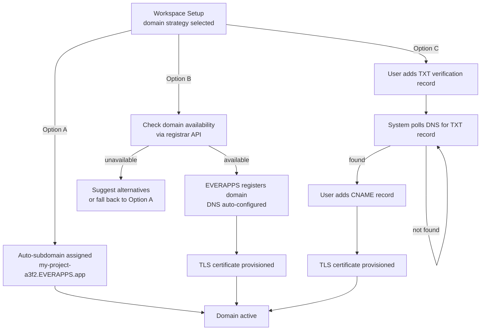
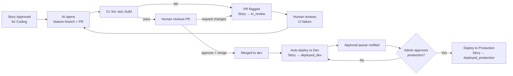
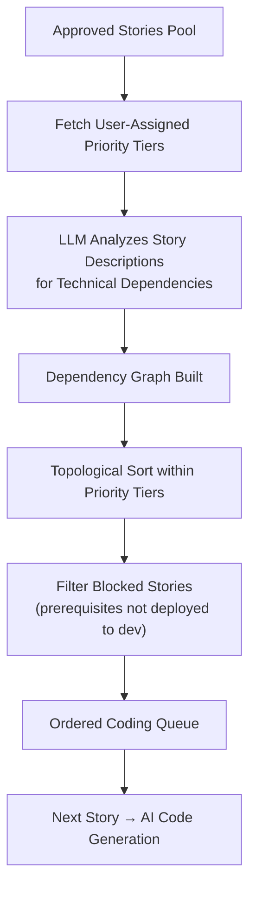

# everapps — Full Application Vision

**Prepared:** March 2026  
**Scope:** The complete product vision for everapps — from raw requirements to deployed, live
applications — organized by phase and across the three supported user entry-point flows.

---

## Vision

The final desired state of everapps is a complete pipeline that converts requirements into
well-defined user stories and then into deployed applications with minimal friction.

```
requirements  →  user stories  →  deployed application
```

Every phase of this pipeline — requirements creation, analysis, refinement, story generation,
code generation, and deployment — is supported by AI assistance, with the human in control at
every approval gate.

---

## The Three Supported Entry Flows

Users enter the pipeline at different starting points depending on what they already have.

| | Flow 1 | Flow 2 | Flow 3 |
|---|---|---|---|
| **Starting point** | Nothing — blank slate | Existing requirements document | Existing requirements + codebase |
| **Requirements source** | Wizard + AI generation | Upload / parse existing doc | Upload / parse existing doc |
| **Codebase source** | AI-generated from scratch | AI-generated from scratch | Import / connect existing repo |
| **First AI action** | Help author requirements | Analyze uploaded document | Analyze doc + codebase together |
| **Remaining steps** | Same as all flows → | ← Same as all flows → | ← Same as all flows |

All three flows converge at the requirements refinement step and follow an identical path from
that point forward.



---

## Prerequisites

The following must be in place before implementation work on the pipeline can begin. They are
ordered by dependency.

### Step 1 — Resolve Open Decisions

Four decisions are currently deferred (see [Open Decisions](#open-decisions) at the end of this
document). Each one is a hard blocker for a specific area of implementation:

| Decision | What it blocks |
|---|---|
| **Deployment platform** | ~~`deployment_service.py` and the CI/CD workflow templates committed into each project repo are entirely platform-specific and cannot be written until this is chosen~~ **Decided: Railway** |
| **AI coding approach** (Option A vs B) | `code_generator.py` is architected completely differently for each option; Option B also requires external agent setup before any coding tasks can run |
| **GitHub org name** | The org must exist before any repos can be provisioned; it is stored in `ProjectRepository.github_org` |
| **Base domain** | Must be registered and DNS-delegated before auto-subdomains can be provisioned or TLS certificates requested |

---

### Step 2 — Register Domain and Configure DNS

1. Register the chosen base domain (e.g., `EVERAPPS.app`) with a domain registrar
2. Delegate DNS management to the chosen platform's nameservers or a standalone DNS provider
   (e.g., Cloudflare, Route 53)
3. Create a wildcard `A` or `CNAME` record: `*.EVERAPPS.app` → EVERAPPS's ingress IP or
   load balancer hostname
4. Obtain a wildcard TLS certificate for `*.EVERAPPS.app` via Let's Encrypt DNS-01 challenge
   or the chosen platform's managed certificate service; configure auto-renewal

---

### Step 3 — Create GitHub Organization and Credentials

1. Create the GitHub organization (e.g., `EVERAPPS-projects`) under the EVERAPPS account
2. Provision a **GitHub App** (preferred over a Personal Access Token for production) with the
   following permissions:
   - `Contents: Read & Write` — create repos, branches, commits
   - `Pull requests: Read & Write` — open PRs with story metadata
   - `Workflows: Read & Write` — commit `.github/workflows/` files to new repos
   - `Administration: Read & Write` — configure branch protection rules
   - `Webhooks: Read & Write` — register per-repo webhooks pointing back to EVERAPPS
3. Download the GitHub App private key (PEM); store it securely — it will be added to
   EVERAPPS's environment secrets
4. Install the GitHub App on the `EVERAPPS-projects` organization
5. Generate a **webhook secret** (a random 32+ character string) to be shared between GitHub
   and EVERAPPS's `POST /api/v1/pipeline/webhook` endpoint for payload signature verification

> **Why a GitHub App over a PAT?** A GitHub App authenticates as the app installation (not a
> personal user account), can be scoped precisely to the org, has higher API rate limits
> (15,000 requests/hour vs 5,000 for PATs), and does not break if a team member leaves.

---

### ~~Step 4 — Deploy EVERAPPS Itself~~ ✓ COMPLETE

~~This is the most critical operational prerequisite. **GitHub webhooks require a publicly reachable
HTTPS URL** to deliver events to. The `POST /api/v1/pipeline/webhook` endpoint must be live on
the internet before any project repository can register a webhook pointing to it.~~

EVERAPPS is now deployed with a GitHub repository, CI/CD pipeline (GitHub Actions), and Railway
environments for `develop`, `staging`, and `main`. The deployment infrastructure and promotion
workflows are documented in [`docs/cicd-pipeline-strategy.md`](cicd-pipeline-strategy.md) and
[`docs/git-branching-strategy.md`](git-branching-strategy.md).

---

### ~~Step 5 — Set Up Railway Account~~ ✓ COMPLETE

~~Create a Railway account and provision API access:~~

Railway is configured with three environments (`develop`, `staging`, `production`), each connected
to the corresponding GitHub branch. Deployments are triggered automatically on every push to those
branches. The Railway account and API token are already provisioned.

The API token is used by `deployment_service.py` to programmatically create and manage
Railway projects, services, and environments for each generated project.

---

### Step 6 — Configure External Coding Agent (Option B Only)

Skip this step if Option A (extend existing LLM service) is chosen.

If Option B (external coding agent webhook) is chosen:

1. Set up the external agent service (Cursor background agent, GitHub Copilot Workspace, or
   equivalent)
2. Obtain the agent's inbound webhook URL and API key
3. Configure the agent's outbound callback to point to EVERAPPS's
   `POST /api/v1/pipeline/webhook` endpoint when a PR is opened
4. Test the round-trip: EVERAPPS fires outbound webhook → agent creates branch + PR →
   GitHub webhook fires back → EVERAPPS updates story status

---

### Step 7 — Add New Environment Variables

The existing [`.env.example`](.env.example) must be extended with the following before the new
services can run. Add these to both `.env.example` (as documentation) and to the production
secrets manager on the chosen deployment platform.

```bash
# ── GitHub Integration ────────────────────────────────────────────────────────
GITHUB_ORG=EVERAPPS-projects
GITHUB_APP_ID=                         # numeric App ID from GitHub App settings
GITHUB_APP_PRIVATE_KEY=                # contents of the downloaded .pem key file
GITHUB_APP_INSTALLATION_ID=            # installation ID for the org
GITHUB_WEBHOOK_SECRET=                 # shared secret for X-Hub-Signature-256 validation

# ── Deployment Platform (Railway) ─────────────────────────────────────────────
RAILWAY_API_TOKEN=                     # Account Settings → Tokens in Railway dashboard

# ── Domain ────────────────────────────────────────────────────────────────────
BASE_DOMAIN=EVERAPPS.app              # base for auto-provisioned project subdomains
EVERAPPS_PUBLIC_URL=                  # e.g. https://app.EVERAPPS.com

# ── Coding Agent (Option B only) ─────────────────────────────────────────────
CODING_AGENT_WEBHOOK_URL=              # URL to POST story payloads to
CODING_AGENT_API_KEY=                  # auth key for the external agent

# ── Domain Registrar (provisioned domains) ───────────────────────────────────
DOMAIN_REGISTRAR_API_KEY=             # API key for programmatic domain registration
DOMAIN_REGISTRAR_PROVIDER=            # e.g. "namecheap", "cloudflare", "name.com"
```

---

### Step 8 — Author Alembic Database Migrations

The new models each require an Alembic migration before any of the new API routes can function.
These migrations must be authored, reviewed, and tested against the existing schema before any
feature branch goes to staging.

Suggested migration order to respect foreign key dependencies:

1. `workspaces` (FK → `projects`)
2. `requirements_documents` (FK → `projects`, `workspaces`)
3. `project_repositories` (FK → `projects`)
4. `project_deployments` (FK → `projects`, `project_repositories`)
5. `project_domains` (FK → `projects`)
6. `story_code_tasks` (FK → `stories`, `projects`, `project_repositories`)
7. `change_events` (FK → `projects`, polymorphic entity references)

---

### Prerequisites Summary

```
Step 1 — Resolve open decisions
        ├── Deployment platform  ✓ DECIDED: Railway
        ├── AI coding approach (Option A or B)
        ├── GitHub org name
        └── Base domain
Step 2 — Register domain + configure wildcard DNS + obtain wildcard TLS cert
Step 3 — Create GitHub org + provision GitHub App + generate webhook secret
Step 4 — Deploy EVERAPPS itself (git repo → CI/CD → live public URL)  ✓ COMPLETE
Step 5 — Set up Railway account + obtain API token  ✓ COMPLETE
Step 6 — Configure external coding agent  [Option B only]
Step 7 — Add new environment variables to .env.example + production secrets
Step 8 — Author and test Alembic migrations for all new models
```

None of Steps 2–8 require application code changes — they are infrastructure and account setup
that unlock the implementation work described below.

---

## Phase 1: Project & Workspace Setup

Every pipeline run begins with a project and a workspace. These are the two root-level entities
that organize all downstream artifacts — requirements, stories, code, and deployments.

### 1.1 Project Creation

A **project** is the top-level container. It holds a name, description, and the user's chosen
entry flow (1, 2, or 3). The project is created first, before any requirements or codebase work
begins.

The project creation UI collects:
- Project name and description
- Entry flow selection (guides the next steps the user sees)
- Intended tech stack (optional at creation; can be refined during requirements analysis)

### 1.2 Workspace Setup

A **workspace** is provisioned immediately after project creation. The workspace holds
environment configuration, codebase linkage, and deployment targets. Each project has exactly
one workspace.

Workspace setup collects:
- Environment names (defaults: `dev`, `production`; custom names allowed)
- Deployment target preferences (auto subdomain, EVERAPPS-provisioned domain, or custom domain)
- Codebase connection details (Flow 3 only: Git URL or upload)

**New data model — `Workspace`** (`backend/app/models/workspace.py`):

```python
class Workspace(Base):
    __tablename__ = "workspaces"

    id: UUID                      # primary key
    project_id: UUID              # FK → projects.id (one-to-one)
    tech_stack: str | None        # e.g. "nextjs-fastapi", "react-node"
    environments: list[str]       # e.g. ["dev", "production"]
    # domain_strategy: auto_subdomain | everapps_provisioned | custom_user_domain
    domain_strategy: str
    codebase_source: str | None   # "scratch" | "import_git" | "import_zip"
    codebase_url: str | None      # Git URL for Flow 3 imports
    created_at: datetime
    updated_at: datetime
```

**Workspace provisioning flow:**



---

## Phase 2: Requirements Management

Phase 2 covers everything from first entering requirements into the system through to a
requirements document that is complete and ready to be converted into user stories. The path
through Phase 2 depends on which entry flow the user selected.

### 2.1 Flow 1 — Wizard-Based Requirements Creation

Users who have no existing requirements document work through a guided wizard. The wizard asks
structured questions about the project's goals, intended users, key features, constraints, and
non-functional requirements. AI provides suggestions and completions throughout.

**Wizard structure:**

| Step | Wizard section | AI assistance |
|---|---|---|
| 1 | Project goals and success criteria | Suggest measurable success metrics |
| 2 | Target users and personas | Suggest common persona types for the described domain |
| 3 | Core feature areas | Suggest features based on project goals |
| 4 | Constraints and assumptions | Flag common omissions (e.g., auth, accessibility) |
| 5 | Non-functional requirements | Suggest performance, security, and scalability requirements |
| 6 | Integrations and data sources | Identify likely third-party dependencies |

Each wizard section produces a structured block of requirements text. The combined output forms
the initial `RequirementsDocument`.

**New data model — `RequirementsDocument`** (`backend/app/models/requirements.py`):

```python
class RequirementsDocument(Base):
    __tablename__ = "requirements_documents"

    id: UUID                      # primary key
    project_id: UUID              # FK → projects.id
    workspace_id: UUID            # FK → workspaces.id
    # source: wizard | upload_text | upload_file | codebase_import
    source: str
    raw_content: str              # original uploaded or wizard-generated text
    structured_content: dict      # parsed sections as JSON
    file_name: str | None         # original filename if uploaded
    file_type: str | None         # "pdf" | "docx" | "md" | "txt"
    # analysis_status: pending | analyzing | complete | error
    analysis_status: str
    analysis_result: dict | None  # AI analysis output (completeness, gaps, issues)
    version: int                  # increments on each refinement save
    created_at: datetime
    updated_at: datetime
```

---

### 2.2 Flow 2 — Upload and Parse Existing Requirements Document

Users who already have a requirements document upload it directly. The system accepts common
formats and extracts the content for analysis.

**Supported formats:** PDF, DOCX, Markdown, plain text

**Parsing flow:**
1. User uploads file via the Requirements panel
2. System extracts raw text (PDF/DOCX via parser service; Markdown/text directly)
3. AI performs an initial structural parse: identifies sections, headings, requirement statements,
   and any embedded acceptance criteria or user story fragments
4. Parsed content is stored in `RequirementsDocument.structured_content`
5. Document is queued for AI analysis (section 2.4)

**New service — `requirements_parser.py`** (`backend/app/services/requirements_parser.py`):
- Accepts raw file bytes + MIME type
- Extracts text content from PDF (via `pdfplumber` or similar), DOCX (via `python-docx`), and
  plain text formats
- Calls the LLM to structure the extracted text into typed sections
  (goals, features, constraints, non-functional requirements, etc.)
- Returns a structured dict compatible with `RequirementsDocument.structured_content`

---

### 2.3 Flow 3 — Import and Connect Existing Codebase

Users who have both a requirements document and an existing codebase import both. The AI
analyzes them together to identify gaps between what is documented and what is already built,
as well as implied requirements that the code reveals but the document does not capture.

**Codebase import options:**

| Option | How it works |
|---|---|
| Git URL | System clones the repo (shallow clone) using stored credentials or a public URL |
| ZIP upload | User uploads a ZIP archive; system extracts and indexes the file tree |

**Codebase analysis produces:**
- A file tree summary (structure, languages, frameworks detected)
- A list of already-implemented features (inferred from the codebase)
- A delta: documented requirements with no corresponding implementation
- A delta: implemented features with no corresponding requirement
- Implied non-functional requirements (e.g., auth patterns found in code)

The codebase analysis output is attached to the `RequirementsDocument` so the AI requirements
analysis in section 2.4 can consider both the document and the code together.

**New service — `codebase_importer.py`** (`backend/app/services/codebase_importer.py`):
- Clones or extracts the codebase
- Detects tech stack and framework (package.json, pyproject.toml, etc.)
- Summarizes the file tree and key entry points
- Calls the LLM to infer implemented features from the codebase structure and key files
- Returns a structured summary attached to the workspace

---

### 2.4 AI Requirements Analysis

After requirements are entered (via wizard, upload, or import), the AI performs a structured
analysis of the requirements document — and, in Flow 3, the codebase as well. The goal is to
surface problems before story generation so that the resulting stories are based on complete,
unambiguous requirements.

**Analysis dimensions:**

| Dimension | What the AI looks for |
|---|---|
| **Completeness** | Missing sections (e.g., no mention of auth, error handling, data retention) |
| **Ambiguity** | Vague language: "fast", "easy to use", "scalable" — flags these for clarification |
| **Missing requirements** | Common requirements implied by the domain that are absent |
| **Dependencies** | Requirements that reference features not defined elsewhere in the document |
| **Contradictions** | Requirements that conflict with each other |
| **Flow 3 delta** | Requirements stated but not implemented; code found with no requirement |

**Analysis output format:**

```json
{
  "overall_completeness_score": 72,
  "issues": [
    {
      "id": "issue-1",
      "type": "ambiguity",
      "section": "Non-functional Requirements",
      "description": "The requirement 'the system must be fast' is ambiguous.",
      "suggestion": "Define specific latency targets, e.g. 'API responses under 200ms at p95'."
    },
    {
      "id": "issue-2",
      "type": "missing_requirement",
      "section": null,
      "description": "No authentication or authorization requirements are specified.",
      "suggestion": "Add requirements for user login, session management, and role-based access."
    }
  ],
  "dependency_warnings": [...],
  "codebase_deltas": [...]  // Flow 3 only
}
```

The analysis result is stored in `RequirementsDocument.analysis_result` and displayed to the
user in the Requirements panel with inline annotations on the document.

---

### 2.5 Requirements Refinement Loop

After analysis the user iterates on the requirements document until it reaches a suitable level
of completeness. "Suitable" is assessed by the AI based on the completeness score and the
severity of remaining issues, but the user makes the final call to proceed.

**Refinement loop:**



Each refinement save increments `RequirementsDocument.version` so the full history of the
document is preserved (see [Phase 6 — Change Tracking](#phase-6-change-tracking--history)).

The wizard provides AI-assisted suggestions when addressing each issue:
- For ambiguity: suggests concrete, measurable replacement language
- For missing requirements: suggests a full requirement statement to insert
- For dependencies: suggests where in the document the referenced feature should be defined
- For contradictions: explains the conflict and suggests a resolution

---

## Phase 3: User Story Generation & Organization

Once requirements are complete, the AI converts them into well-defined user stories and organizes
them into a logical work order ready for development.

### 3.1 AI Story Generation

The AI reads the finalized requirements document and generates a set of user stories following
a consistent structure:

- **Title:** a short action-oriented summary
- **As a / I want / So that:** the standard user story format
- **Description:** expanded context and background
- **Acceptance criteria:** a numbered checklist of conditions that must be true for the story
  to be complete
- **Story points estimate:** AI-generated complexity estimate (Fibonacci scale)
- **Dependencies:** IDs of other stories that must be completed first

Stories are linked to the specific requirements section(s) they originate from, preserving
traceability from requirement to story to code.

**Story generation is not a one-shot operation** — the user can request regeneration of
individual stories, split a story into smaller ones, or merge related stories, all with
AI assistance.

---

### 3.2 Work Order — Logical Sequencing

Once stories are generated they are organized into a work order that determines which stories
go to the AI code agent first. The ordering respects two constraints:

1. **Dependency ordering:** a story cannot be coded before the stories it depends on are
   deployed to dev. The dependency graph built during story generation is used to produce a
   topological sort.
2. **Priority ordering:** within a dependency tier, stories are ordered by user-assigned
   priority (high → medium → low) and, as a secondary signal, by AI-estimated complexity
   (lower complexity first to maximize throughput and reduce WIP).

Users can manually reorder stories within a tier by dragging in the work order view. The system
prevents moving a story above a story it depends on.

**Work order view states:**

| Position | Meaning |
|---|---|
| Ready | No incomplete dependencies; available for coding |
| Blocked | Has dependencies not yet deployed to dev |
| In progress | Actively being coded or in review |
| Complete | Deployed to dev or production |

---

### 3.3 Story Review and Approval

Before any story is sent to the AI code agent it must be reviewed and approved by the user.
Stories can be edited at any point before approval — by the user directly or with AI assistance.

**AI-assisted story editing:**
- Improve the description for clarity
- Strengthen or add acceptance criteria
- Split a story into two more focused stories
- Merge two related stories into one
- Re-estimate story points based on edited content

**Approval gate:** the user explicitly approves each story (or batch-approves a set). Approved
stories enter the work order queue and become eligible for code generation. Approval can be
revoked before coding starts.

---

## Phase 4: AI Code Generation

Phase 4 takes approved, ordered user stories and produces pull requests containing working code
on the project's GitHub repository. The code generation loop runs continuously as stories are
approved, pausing only for human review gates.

### 4.1 Codebase Storage — GitHub Repository per Project

Each everapps project maps 1-to-1 with a dedicated GitHub repository. The repository is created
automatically when a project is first set up for code generation.

**Hosting model:**
- EVERAPPS controls a GitHub organization (e.g., `EVERAPPS-projects`)
- Each project repo is created via the GitHub REST API using a stored organization token
- Repositories are private by default; visibility is configurable per project

**Branch strategy:**

| Branch | Purpose | Deploy target |
|---|---|---|
| `main` | Production-ready code | Production environment |
| `dev` | Integration branch; merged stories awaiting approval | Dev environment |
| `story/{id}-{slug}` | Per-story feature branch opened by the AI agent | — (PR only) |

**On project creation, the system automatically:**
1. Creates the GitHub repo via the GitHub API
2. Commits a starter CI/CD workflow file (`.github/workflows/ci.yml`) bootstrapped from the
   project's tech stack
3. Creates `main` and `dev` branches
4. Creates deployment environments (`dev`, `production`) in GitHub with branch protection rules
5. Registers the repo URL and configuration in the `ProjectRepository` model

**New data model — `ProjectRepository`** (`backend/app/models/repository.py`):

```python
class ProjectRepository(Base):
    __tablename__ = "project_repositories"

    id: UUID  # primary key
    project_id: UUID  # FK → projects.id
    github_org: str   # e.g. "EVERAPPS-projects"
    github_repo: str  # e.g. "my-project-abc123"
    github_url: str   # https://github.com/EVERAPPS-projects/my-project-abc123
    default_branch: str   # "main"
    dev_branch: str       # "dev"
    tech_stack: str | None  # e.g. "nextjs-fastapi", "react-node", etc.
    created_at: datetime
    updated_at: datetime
```

---

### 4.2 AI Code Writing Integration

The AI code writing step takes an approved user story and produces a pull request on the
project's GitHub repository. Two implementation options are documented below; the final
approach is **not yet decided**.

#### Option A — Extend the Existing LLM Service

Add a `code_generator.py` service to the existing `backend/app/services/` layer. This service
would call the existing LLM provider abstraction (`backend/app/services/llm/`) with
code-generation prompts, then commit the resulting code to a feature branch via the GitHub API
and open a pull request.

**How it works:**
1. Story is marked `approved`; a `StoryCodeTask` record is created
2. `code_generator.py` fetches the current repo file tree from GitHub
3. Constructs a prompt containing the story title, description, acceptance criteria, and relevant
   existing code context
4. Calls the project's configured LLM provider (OpenAI, Anthropic, Azure OpenAI, or Ollama)
5. Parses the response into file diffs; commits them to a new `story/{id}-{slug}` branch
6. Opens a pull request targeting `dev`; updates `StoryCodeTask` with the PR URL

**Pros:**
- No new external dependencies; reuses existing LLM provider abstraction
- Single system boundary; simpler auth and secret management
- Works with any LLM provider already configured per-user

**Cons:**
- General-purpose LLMs are not purpose-built coding agents; code quality may be lower
- No IDE context, LSP, or static analysis integration
- Large codebases may exceed context window limits; requires intelligent file chunking

#### Option B — External Coding Agent via Webhook

When a story is approved, EVERAPPS fires a webhook to an external coding agent (e.g., a Cursor
background agent, GitHub Copilot Workspace, or an OpenAI Codex-powered agent). The agent
operates in the GitHub repository directly and opens a pull request when done. EVERAPPS then
receives a webhook from GitHub when the PR is created.

**How it works:**
1. Story is marked `approved`; EVERAPPS fires an outbound webhook with story payload
2. The coding agent clones the repo, reads the story, and writes code with full IDE tooling
3. Agent opens a PR on the `story/{id}-{slug}` branch
4. GitHub PR webhook fires → EVERAPPS's `/api/v1/pipeline/webhook` endpoint updates
   `StoryCodeTask` status to `in_review`

**Pros:**
- Purpose-built coding agents produce significantly higher quality code
- Full repo context, linting, and test execution during code generation
- Agent can iteratively fix test failures before opening the PR

**Cons:**
- External dependency on a third-party agent API; availability risk
- More complex orchestration (outbound webhook + inbound GitHub webhook)
- Additional API key management and per-story cost tracking needed

#### New service — `github_service.py`

Regardless of which Option is chosen, a `github_service.py` is required to interact with the
GitHub REST API. Key responsibilities:

- Create repositories in the EVERAPPS GitHub org
- Create and push branches
- Commit files (individual or batch via Git Trees API)
- Open pull requests with story metadata in the PR description
- Register/manage GitHub repository webhooks
- Query CI/Actions run status

---

## Phase 5: Deployment Lifecycle

Phase 5 covers everything from the first dev deployment through production and beyond. The
iteration loop between development and production is the steady state of an active project.

### 5.1 Dev Environment Iteration Loop

The dev environment is the primary working environment. The loop runs continuously as stories
are coded, reviewed, and deployed:



Stories progress through the dev loop independently — multiple stories can be in different
stages of the loop simultaneously.

---

### 5.2 Deployment Infrastructure — Railway

Each generated project is hosted on **Railway**. The existing
[`docs/deployment-cost-analysis.md`](deployment-cost-analysis.md) covers the full cost breakdown
across evaluated platforms.

#### Railway Deployment Model

Each generated project application requires: a backend service, a frontend service, a managed
PostgreSQL database, and file storage. Railway's Docker-native model maps directly to this
structure.

| Resource | Railway primitive | Notes |
|---|---|---|
| Backend service | Railway Service (Docker) | Deployed from the project's Docker image |
| Frontend service | Railway Service (Docker) | Separate service in the same Railway project |
| PostgreSQL database | Railway Postgres plugin | Managed; connection string injected automatically |
| File storage | External (S3-compatible) | Railway has no native object storage; use Cloudflare R2 or AWS S3 |

**Why Railway:**
- Docker Compose–compatible; CI/CD workflow maps directly to Railway's deploy API
- Lowest setup complexity of evaluated platforms; no cloud provider account required
- Per-project Railway projects provide clean isolation and independent billing visibility
- `RAILWAY_API_TOKEN` is all that's needed to programmatically provision new project environments

Each generated project is provisioned as a separate **Railway project** containing two
environments: `dev` and `production`.

**New data model — `ProjectDeployment`** (`backend/app/models/repository.py`):

```python
class ProjectDeployment(Base):
    __tablename__ = "project_deployments"

    id: UUID  # primary key
    project_id: UUID          # FK → projects.id
    repository_id: UUID       # FK → project_repositories.id
    environment: str          # "dev" | "production"
    platform: str             # "railway" (decided); field retained for future portability
    deploy_url: str | None    # https://my-project.up.railway.app
    last_deploy_sha: str | None
    # status: pending | deploying | live | failed | paused
    status: str
    deployed_at: datetime | None
    created_at: datetime
    updated_at: datetime
```

**Infrastructure provisioning flow:**



---

### 5.3 Domain Strategy

Every deployed project receives a URL at first deployment. Three options are supported,
selected during workspace setup.

#### Option A — Auto Subdomain on EVERAPPS Domain

Every project gets a subdomain under `EVERAPPS.app` automatically upon first deployment.
No user action required.

- **Format:** `{project-slug}.EVERAPPS.app`
- **DNS:** Wildcard DNS record `*.EVERAPPS.app` → EVERAPPS's ingress/reverse proxy
- **Routing:** The Nginx/Caddy reverse proxy inspects the `Host` header and routes to the
  correct deployment container or platform service
- **TLS:** Wildcard certificate provisioned via Let's Encrypt; renewed automatically

The `project-slug` is derived from the project name (lowercased, special characters replaced with
hyphens, truncated to 48 characters) with a short unique suffix appended to avoid collisions.

**Example:** A project named "My E-commerce App" → `my-e-commerce-app-a3f2.EVERAPPS.app`

#### Option B — Custom Domain Provisioned by EVERAPPS

EVERAPPS registers and manages a custom domain on the user's behalf. The user selects or
suggests a domain name; EVERAPPS checks availability and purchases it via a registrar API.

**Flow:**
1. User enters a preferred domain name (e.g., `mystore.com`) in workspace setup
2. EVERAPPS checks availability via the registrar API
3. If available, EVERAPPS registers the domain (billed to the project account)
4. DNS is configured automatically: root and `www` point to the Railway deployment
5. TLS certificate is provisioned and renewed automatically
6. The custom domain is live with no DNS action required from the user

This option requires a domain registrar API integration (see `DOMAIN_REGISTRAR_API_KEY`
in Step 7). The chosen registrar must support programmatic DNS management.

#### Option C — Custom Domain Owned by the User

Project owners can configure a domain they already own in the project settings.

**Verification and activation flow:**
1. User enters their custom domain (e.g., `app.mycompany.com`) in the Domain Configuration UI
2. EVERAPPS generates a DNS verification token and instructs the user to add a `TXT` record:
   `_everapps-verify.app.mycompany.com → everapps-verify={token}`
3. EVERAPPS polls DNS (or the user triggers re-verification) until the `TXT` record resolves
4. Once verified, the user updates their DNS to add a `CNAME`:
   `app.mycompany.com → {project-slug}.EVERAPPS.app`
5. EVERAPPS provisions a dedicated TLS certificate via Let's Encrypt ACME HTTP-01 or DNS-01
   challenge
6. The reverse proxy begins accepting requests on the custom domain

**New data model — `ProjectDomain`** (`backend/app/models/repository.py`):

```python
class ProjectDomain(Base):
    __tablename__ = "project_domains"

    id: UUID  # primary key
    project_id: UUID             # FK → projects.id
    subdomain_slug: str          # "my-e-commerce-app-a3f2"
    # domain_strategy: auto_subdomain | everapps_provisioned | custom_user_domain
    domain_strategy: str
    provisioned_domain: str | None   # domain registered by EVERAPPS on user's behalf
    custom_domain: str | None        # "app.mycompany.com" — user-owned
    # dns_status: unverified | verified | active | error
    dns_status: str
    tls_status: str              # pending | provisioning | active | error
    verification_token: str | None
    verified_at: datetime | None
    registrar_order_id: str | None   # external registrar reference (Option B)
    created_at: datetime
    updated_at: datetime
```



---

### 5.4 Deployment Readiness — Hybrid Gate

A project deployment requires **both** conditions to be satisfied before it reaches production:

1. **CI pipeline must pass** — linting, unit tests, Docker build, and integration tests all green
2. **Human approval required** — a project admin reviews the CI result and explicitly approves
   the production deployment

Dev is less strict: merges to `dev` deploy automatically when CI passes (no human gate).

**Gate rules by environment:**

| Environment | Trigger | CI required | Human approval |
|---|---|---|---|
| Dev | Story PR merged to `dev` | Yes | No |
| Production | Human clicks "Approve for Production" | Yes (must already be green) | **Yes** |

**Deployment flow:**



---

### 5.5 Continuous Iteration

A project does not stop at first production deployment. New requirements can be added at any
time, re-entering the pipeline at Phase 2 (requirements analysis) and flowing through to new
stories and new deployments.

**Iteration entry points:**
- Add new requirements to the existing document → re-run AI analysis → generate new stories
- Edit existing requirements → re-analyze affected stories → re-generate or update stories
- User feedback from production → create new requirement → follow full pipeline

Each iteration produces a new `RequirementsDocument` version and a new batch of stories,
all tracked in the change history (Phase 6).

---

## Phase 6: Change Tracking & History

All changes throughout the pipeline are tracked so the user can review history, understand what
changed and why, and revert to a previous state at any level.

### 6.1 Git-Native History

The project's GitHub repository provides the primary change history for code:

- Every AI-generated commit is attributed with a structured commit message referencing the
  story ID and title
- Every PR links back to the everapps story that triggered it
- Branch history is preserved even after merging (no squash-merge by default)
- Rolling back code means reverting or cherry-picking commits in the GitHub repo, which
  triggers the CI/CD pipeline and redeploys

### 6.2 Application-Level Audit Trail

Code changes are only one dimension. The application also tracks changes to requirements,
stories, and deployment events in a structured audit log.

**Events captured:**

| Entity | Events tracked |
|---|---|
| `RequirementsDocument` | Created · version saved · AI analysis run · marked complete |
| `Story` | Generated · edited (by user) · edited (by AI) · approved · approval revoked |
| `StoryCodeTask` | Coding started · PR opened · CI passed/failed · merged · deployed dev · deployed production |
| `ProjectDeployment` | Deployment triggered · deployment succeeded · deployment failed · rolled back |
| `ProjectDomain` | Domain configured · verification passed · TLS provisioned |

**New data model — `ChangeEvent`** (`backend/app/models/change_event.py`):

```python
class ChangeEvent(Base):
    __tablename__ = "change_events"

    id: UUID                   # primary key
    project_id: UUID           # FK → projects.id
    entity_type: str           # "requirements_document" | "story" | "story_code_task" | "deployment" | "domain"
    entity_id: UUID            # ID of the affected entity
    event_type: str            # e.g. "story.approved", "deployment.succeeded"
    actor: str                 # "user" | "ai" | "system" | "github_webhook"
    actor_user_id: UUID | None # FK → users.id (if actor is "user")
    before_state: dict | None  # snapshot of entity before change
    after_state: dict | None   # snapshot of entity after change
    metadata: dict | None      # additional context (PR URL, CI run URL, etc.)
    occurred_at: datetime
```

### 6.3 Revert and Rollback

**Story-level revert:**
- Reverting a story means un-deploying the code changes associated with that story's PR
- The system creates a revert commit on the GitHub repo targeting the story's merge commit
- CI runs on the revert commit; if it passes, the revert deploys automatically to dev
- The user must explicitly approve the revert to production

**Requirements-level revert:**
- Any previous version of the `RequirementsDocument` can be restored
- Restoring a version does not automatically re-generate stories — the user must trigger
  story re-generation manually after reviewing the restored requirements
- A `ChangeEvent` is recorded for the restore action

**Deployment-level rollback:**
- Production can be rolled back to the last known good deployment SHA via the Approval Queue
- Railway's deploy API accepts a specific image tag or commit SHA for rollback

---

## Story Status Lifecycle

The story status field tracks a story from first AI generation through to production
deployment. The full lifecycle spans the requirements phase (Phase 2–3) through the coding
and deployment pipeline (Phase 4–5).

**Full status lifecycle:**

| Status | Description | Trigger |
|---|---|---|
| `generated` | AI-generated from requirements; not yet reviewed | AI story generation |
| `draft` | Manually created or edited after generation | User edit or manual creation |
| `reviewed` | AI review complete; feedback attached | `StoryReview` created |
| `approved` | Accepted by user; queued for coding | Human approval action |
| `exported` | Pushed to PM tool (Jira, Asana, etc.) | PM export action |
| `coding` | AI agent actively generating code | `StoryCodeTask` created, coding started |
| `in_review` | PR opened; awaiting human code review | GitHub PR webhook |
| `testing` | PR merged to dev; CI running | GitHub merge webhook |
| `deployed_dev` | CI passed; live on dev environment | CI success webhook |
| `deployed_production` | Approved and live on production | Human approval + deploy webhook |

> **Note:** `approved` and `exported` are not mutually exclusive — a story can be exported to a
> PM tool and still proceed through the coding pipeline independently.

### Webhook-Driven Status Transitions

Story status transitions in the coding pipeline are driven by **GitHub webhook events** delivered
to a new EVERAPPS endpoint. This keeps story status automatically in sync with real GitHub
activity without polling.

**Webhook events and resulting transitions:**

| GitHub Event | Payload condition | Story status transition |
|---|---|---|
| `pull_request` (opened) | PR branch matches `story/{id}-*` | `coding` → `in_review` |
| `pull_request` (closed, merged=false) | PR closed without merge | `in_review` → `coding` (retry) |
| `pull_request` (closed, merged=true) | PR merged to `dev` | `in_review` → `testing` |
| `workflow_run` (completed, conclusion=success) | CI run on `dev` branch | `testing` → `deployed_dev` |
| `workflow_run` (completed, conclusion=failure) | CI run on `dev` branch | `testing` → `in_review` (flagged) |
| `deployment_status` (success, env=production) | Platform deploy event | → `deployed_production` |

**New router — `pipeline.py`** (`backend/app/routers/pipeline.py`):
- `POST /api/v1/pipeline/webhook` — receives signed GitHub webhook payloads, validates the
  `X-Hub-Signature-256` header, routes events to the appropriate handler, and updates
  `StoryCodeTask` + `Story.status` accordingly.
- `GET /api/v1/pipeline/{project_id}/status` — returns current pipeline status for all stories
  in a project.
- `POST /api/v1/pipeline/{project_id}/approve-production` — human approval gate endpoint;
  triggers the production deploy after CI has passed.

**New router — `codegen.py`** (`backend/app/routers/codegen.py`):
- `POST /api/v1/codegen/stories/{story_id}/start` — manually trigger AI code generation for
  a specific approved story.
- `POST /api/v1/codegen/stories/{story_id}/cancel` — cancel an in-progress code generation job.
- `POST /api/v1/codegen/stories/{story_id}/retry` — retry a failed code generation task.
- `GET /api/v1/codegen/projects/{project_id}/queue` — return the prioritized coding queue for
  a project.

**New data model — `StoryCodeTask`** (`backend/app/models/codetask.py`):

```python
class StoryCodeTask(Base):
    __tablename__ = "story_code_tasks"

    id: UUID  # primary key
    story_id: UUID               # FK → stories.id
    project_id: UUID             # FK → projects.id
    repository_id: UUID          # FK → project_repositories.id
    feature_branch: str          # "story/42-user-login"
    pr_url: str | None           # GitHub PR URL
    pr_number: int | None
    ci_run_url: str | None       # GitHub Actions run URL
    ai_job_id: str | None        # External agent job reference (Option B)
    # pipeline_status: queued | coding | in_review | testing | deployed_dev | deployed_production | failed
    pipeline_status: str
    failure_reason: str | None
    coding_started_at: datetime | None
    pr_opened_at: datetime | None
    merged_at: datetime | None
    deployed_dev_at: datetime | None
    deployed_production_at: datetime | None
    created_at: datetime
    updated_at: datetime
```

### Priority Determination — Hybrid Approach

The order in which stories are sent to the AI coding agent is determined by a **hybrid priority
engine** that combines two signals:

**Signal 1 — User-Assigned Priority (primary)**
Stories are assigned a priority tier (high / medium / low) by the user during story review and
approval (Phase 3.3). This provides the human-curated base priority order.

**Signal 2 — AI Dependency Adjustment (secondary)**
The LLM analyzes the set of approved stories and identifies technical dependencies — for example,
a "Create User Account" story must be coded before a "User Login" story. The AI reorders stories
within the same priority tier to ensure upstream work is completed first.

Additional ordering rules applied within each priority tier:
- **Unblocked first**: stories with no incomplete prerequisites are surfaced before blocked ones
- **Complexity estimate**: lower story-point stories are preferred within a tier to increase
  throughput and reduce WIP

**New service — `story_prioritizer.py`** (`backend/app/services/story_prioritizer.py`):

```python
class StoryPrioritizer:
    async def prioritize(self, project_id: UUID) -> list[UUID]:
        """
        Returns an ordered list of story IDs ready for coding.
        1. Fetch user-assigned priority tiers for approved stories
        2. Call LLM to identify dependency pairs among the stories
        3. Perform topological sort within priority tiers
        4. Filter out stories that are blocked (prerequisites not yet deployed to dev)
        5. Return ordered list; first story is next to be coded
        """
```

**Priority flow:**



---

## New Files Summary

### Backend Models

| File | Models |
|---|---|
| `backend/app/models/workspace.py` | `Workspace` |
| `backend/app/models/requirements.py` | `RequirementsDocument` |
| `backend/app/models/repository.py` | `ProjectRepository`, `ProjectDeployment`, `ProjectDomain` |
| `backend/app/models/codetask.py` | `StoryCodeTask` |
| `backend/app/models/change_event.py` | `ChangeEvent` |

### Backend Services

| File | Responsibility |
|---|---|
| `backend/app/services/requirements_wizard.py` | Wizard step orchestration; AI suggestion generation per step |
| `backend/app/services/requirements_parser.py` | Extract and structure text from uploaded PDF, DOCX, Markdown files |
| `backend/app/services/requirements_analyzer.py` | AI analysis: completeness, ambiguity, gaps, dependency, contradiction detection |
| `backend/app/services/codebase_importer.py` | Clone or extract existing codebase; infer implemented features via LLM |
| `backend/app/services/github_service.py` | GitHub API: repo creation, branches, commits, PRs, webhooks |
| `backend/app/services/code_generator.py` | AI code generation orchestration (Option A or B) |
| `backend/app/services/story_prioritizer.py` | Hybrid user-priority + AI dependency ordering |
| `backend/app/services/deployment_service.py` | Railway deployment triggers via Railway API |
| `backend/app/services/domain_service.py` | Subdomain slug generation, registrar API (Option B), DNS verification, TLS provisioning |

### Backend Routers

| File | Endpoints |
|---|---|
| `backend/app/routers/workspace.py` | Workspace creation and configuration |
| `backend/app/routers/requirements.py` | Requirements wizard steps; upload; analysis; refinement; versioning |
| `backend/app/routers/codegen.py` | Start / cancel / retry code generation; view coding queue |
| `backend/app/routers/deployments.py` | Deployment management; approve production; domain config |
| `backend/app/routers/pipeline.py` | GitHub webhook receiver; pipeline status; approval gate |

### Frontend Components

| Component | Purpose |
|---|---|
| `ProjectCreateWizard` | Project creation with entry flow selection |
| `WorkspaceSetupPanel` | Environment config, domain strategy selection, codebase connection |
| `RequirementsWizard` | Multi-step wizard for guided requirements authoring (Flow 1) |
| `RequirementsUploadPanel` | File upload, parse preview, and analysis trigger (Flows 2 & 3) |
| `CodebaseImportPanel` | Git URL or ZIP upload for existing codebase import (Flow 3) |
| `RequirementsAnalysisPanel` | AI analysis results with inline issue annotations and fix wizard |
| `StoryWorkOrderBoard` | Drag-and-drop work order view with dependency visualization |
| `StoryEditorPanel` | Story edit with AI-assist: improve, split, merge, re-estimate |
| `StoryPipelineBoard` | Kanban-style board showing stories across all coding pipeline stages |
| `DeploymentStatusPanel` | Per-project panel: dev + production URLs, last deploy time, CI badge |
| `DomainConfigPanel` | Domain strategy selection, registrar flow (Option B), DNS verification (Option C) |
| `ApprovalQueue` | Notification list for PRs awaiting code review and deployments awaiting production approval |
| `ChangeHistoryPanel` | Timeline of all change events; revert and rollback controls |

---

## Open Decisions

| Decision | Options | Status |
|---|---|---|
| Deployment platform for generated projects | ~~Railway, Fly.io, Google Cloud Run, Render~~ | **Decided: Railway** |
| AI coding integration approach | Option A (extend LLM service) vs Option B (external agent webhook) | Not decided |
| GitHub org name for project repos | e.g., `EVERAPPS-projects` | Not decided |
| Subdomain base domain | e.g., `EVERAPPS.app` — requires domain registration | Not decided |
| Requirements analysis strategy | Single LLM pass vs multi-agent (separate agents per dimension: completeness, ambiguity, dependencies) | Not decided |
| Codebase import approach | Git clone (shallow) vs ZIP upload vs both | Not decided |
| EVERAPPS-provisioned domain registrar | Which registrar API to use; naming conventions; billing model for provisioned domains | Not decided |
| Change tracking storage granularity | Full before/after snapshots in `ChangeEvent` vs lightweight event log + separate version table per entity | Not decided |

---

*Document updated March 2026 · everapps full vision*
