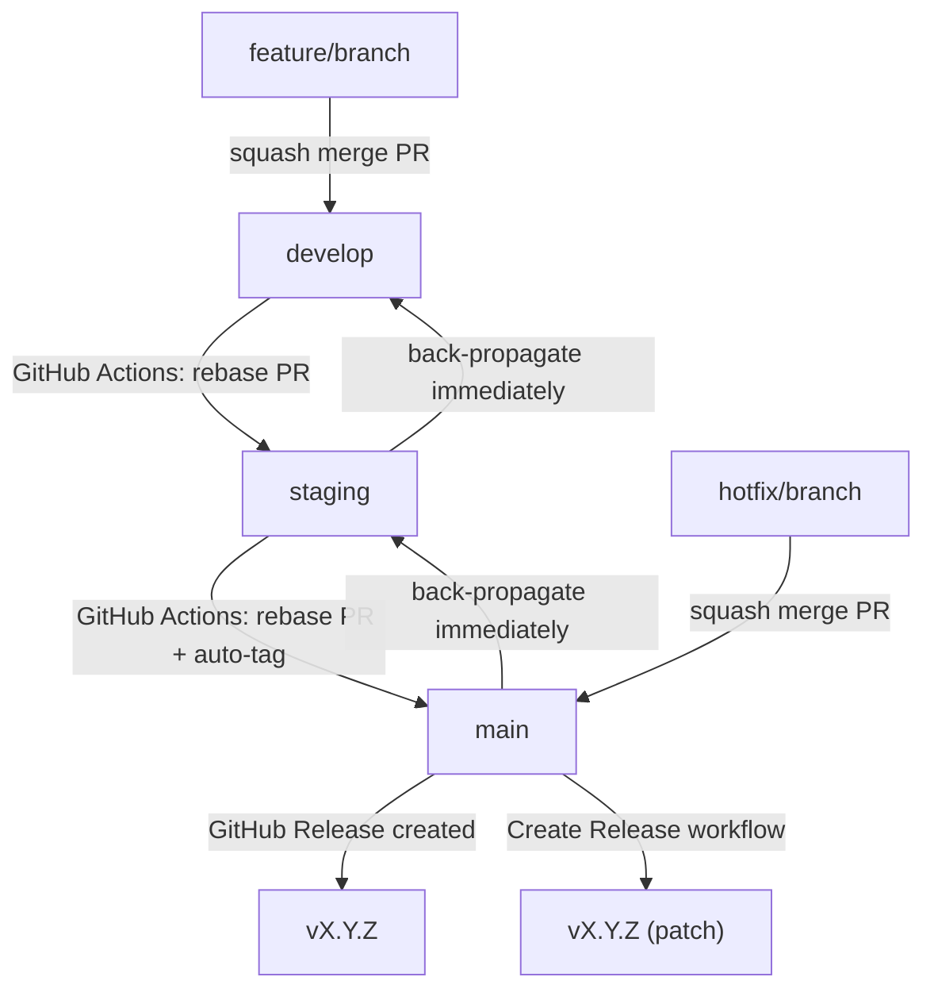

# Git Branching & Promotion Strategy

## Overview

This project uses three long-lived branches, each mapped to a Railway deployment environment:

| Branch    | Railway Environment |
|-----------|---------------------|
| `develop` | Development         |
| `staging` | Staging             |
| `main`    | Production          |

Feature branches are ephemeral and always branch from `develop`.

---

## The Golden Rule

> **Changes only ever flow upward: `develop → staging → main`.**
>
> Nothing is ever committed directly to `staging` or `main` — those branches only receive changes via promotion through GitHub Actions.

Violating this rule is the primary cause of merge conflicts and branch divergence.

---

## Standard Workflow

### 1. Feature Development

```bash
# Branch from develop
git checkout develop
git pull origin develop
git checkout -b feature/my-feature

# Do work, commit locally
git add .
git commit -m "feat: describe the change"

# Push and open a PR into develop
git push origin feature/my-feature
```

Open a PR targeting `develop`. Once reviewed and approved, **squash merge** the feature branch into `develop`. The repo is configured to only allow squash and rebase merges — merge commits are disabled to keep history linear.

### 2. Promoting develop → staging

After testing in the Railway develop environment, trigger the promotion workflow:

1. Go to **GitHub → Actions → Promote develop → staging**
2. Click **Run workflow** → select branch `develop` → **Run workflow**

The workflow runs a pre-flight check comparing the file trees of both branches. If staging already has develop's content it exits cleanly. Otherwise it creates a PR from `develop` into `staging` and rebase-merges it automatically.

### 3. Promoting staging → main

After testing in the Railway staging environment:

1. Go to **GitHub → Actions → Promote staging → main**
2. Click **Run workflow** → select branch `develop`
3. Choose the **version bump type**: `patch`, `minor`, or `major`
4. Click **Run workflow**

The workflow promotes staging to main, then automatically creates an annotated git tag and a GitHub Release with categorized release notes.

---

## Why Rebase Merges for Promotions?

Promotions use **rebase merge** (via `gh pr merge --rebase`) rather than squash or regular merge. This is the correct strategy for a promotion chain because:

- Rebase replays each individual commit from the source branch onto the target, creating new SHAs but preserving a linear ancestry chain
- Each target branch remains a direct ancestor of the next — `develop` commits are in `staging`'s history, `staging` commits are in `main`'s history
- This means the next promotion always has a clean, unambiguous merge base with no conflicts

Squash merges break this chain permanently (each squash creates a new SHA with no ancestry link), causing merge conflicts on every subsequent promotion.

---

## Hotfix Protocol

When a critical bug requires an immediate fix to production without waiting for the full pipeline:

```bash
# 1. Branch from main (not develop)
git checkout main
git pull origin main
git checkout -b hotfix/describe-the-fix

# 2. Fix, commit, and open a PR into main
git add .
git commit -m "fix: describe the fix"
git push origin hotfix/describe-the-fix
# → Squash merge PR into main via GitHub
```

**Immediately after merging to `main`, back-propagate downward using the promotion workflows in reverse:**

1. Run **Promote develop → staging** — this will detect that staging is now behind main and handle the sync
2. If needed, manually open a PR from `main` into `staging`, then from `staging` into `develop` to back-propagate the hotfix

Back-propagation must happen right away. Deferring it is how branches drift apart.

After back-propagating, use the **Create Release** workflow to tag the hotfix:

1. Go to **GitHub → Actions → Create Release**
2. Select bump type `patch`, branch `main`
3. Click **Run workflow**

---

## Version Tagging

Tags mark production releases and provide a permanent reference to exactly what is running in production. Tags always live on `main` and are created automatically by the **Promote staging → main** workflow.

### Versioning scheme

Use [Semantic Versioning](https://semver.org/): `vMAJOR.MINOR.PATCH`

| Segment | Increment when... |
|---------|-------------------|
| `MAJOR` | Breaking changes or major product milestones |
| `MINOR` | New backward-compatible features |
| `PATCH` | Bug fixes and hotfixes |

The workflow reads the latest tag and auto-increments based on your bump selection. No manual version entry required. If no tags exist, versioning starts from `v0.0.0`.

### Viewing tags

```bash
git tag -l              # list all tags
git show v1.2.0         # inspect a specific tag
```

---

## Recovering from Branch Divergence

The promotion workflows include a pre-flight check that compares file trees between branches. If a promotion detects that the target branch has content the source doesn't, it fails with a diagnostic message.

**Common causes:**
- A hotfix was merged to `main` but never back-propagated to `staging` and `develop`
- A PR was merged directly to `staging` or `main` bypassing the workflow

**To investigate:**

```bash
git fetch origin

# What main has that staging doesn't
git log --oneline origin/staging..origin/main

# What staging has that develop doesn't  
git log --oneline origin/develop..origin/staging
```

In most cases: back-propagate the missing commits downward (hotfix PRs from main → staging → develop), then re-run the promotion workflow.

---

## Workflow Diagram



---

## Repository Settings (GitHub)

The following settings are configured and should not be changed:

**Merge strategy (repo-wide):**
- Merge commits: **disabled**
- Squash merges: **enabled** (for feature branches into develop)
- Rebase merges: **enabled** (used by promotion workflows)

**Rulesets:**
- `protect-develop`: requires pull request before merging
- `protect-main-staging`: requires pull request + linear history (no merge commits)

**Default branch:** `develop`

---

## Quick Reference

### Normal feature cycle

```bash
# 1. Create feature branch
git checkout develop && git pull origin develop
git checkout -b feature/my-feature

# 2. Work, commit, push, open PR into develop
git push origin feature/my-feature
# → Squash merge via GitHub PR

# 3. Promote via GitHub Actions
# Actions → Promote develop → staging → Run workflow
# Actions → Promote staging → main → Run workflow (select bump type)
```

### Hotfix

```bash
# Branch from main, fix, squash merge PR into main, then:
# Actions → Create Release → bump: patch, branch: main → Run workflow
# Manually open back-propagation PRs: main → staging → develop
```

### Check branch state

```bash
git fetch origin
git log --oneline origin/develop -5   # latest on develop
git log --oneline origin/staging -5   # latest on staging
git log --oneline origin/main -5      # latest on main
git tag -l | sort -V | tail -5        # recent release tags
```
