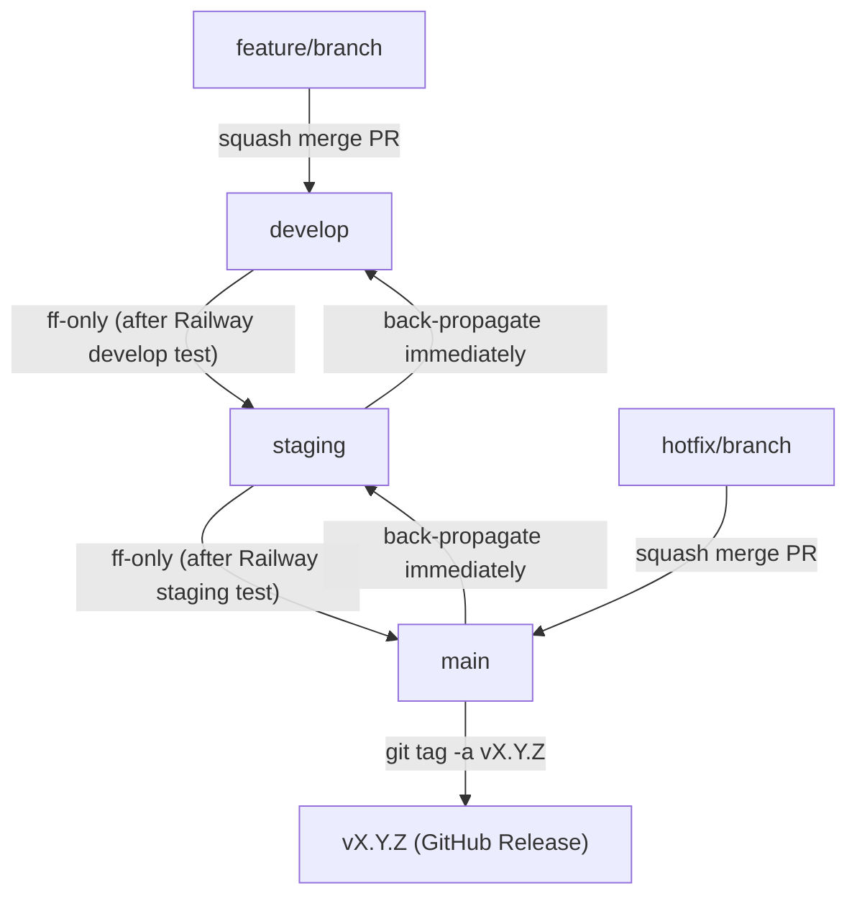

# Git Branching & Promotion Strategy

## Overview

This project uses three long-lived branches, each mapped to a Railway deployment environment:

| Branch    | Railway Environment |
|-----------|---------------------|
| `develop` | Development         |
| `staging` | Staging             |
| `main`    | Production          |

Feature branches are ephemeral and always branch from `develop`.

---

## The Golden Rule

> **Changes only ever flow upward: `develop → staging → main`.**
>
> Nothing is ever committed directly to `staging` or `main` — those branches only receive changes via promotion merges from the branch below them.

Violating this rule is the primary cause of merge conflicts.

---

## Standard Workflow

### 1. Feature Development

```bash
# Branch from develop
git checkout develop
git pull origin develop
git checkout -b feature/my-feature

# Do work, commit locally
git add .
git commit -m "feat: describe the change"

# Push and open a PR into develop
git push origin feature/my-feature
```

Open a PR targeting `develop`. Once reviewed and approved, **squash merge** the feature branch into `develop`. Squashing keeps `develop`'s history linear, which is what makes conflict-free promotion possible.

### 2. Promoting develop → staging

After testing in the Railway develop environment:

```bash
git checkout staging
git pull origin staging
git merge --ff-only develop
git push origin staging
```

### 3. Promoting staging → main

After testing in the Railway staging environment:

```bash
git checkout main
git pull origin main
git merge --ff-only staging
git push origin main
```

---

## Why `--ff-only`?

`--ff-only` (fast-forward only) means Git will refuse to create a merge commit. The merge only succeeds if the target branch has no commits that the source branch doesn't already contain.

```
Before:  develop: A - B - C
         staging: A - B       ← staging is behind, ff-only succeeds

After:   staging: A - B - C   ← staging pointer just moves forward
```

If `--ff-only` fails, it means `staging` (or `main`) has diverged — it contains commits that `develop` does not. **This is a signal to stop and investigate**, not to force a merge. See the [Recovering from Diverged Branches](#recovering-from-diverged-branches) section.

---

## Hotfix Protocol

When a critical bug requires an immediate fix to production without waiting for the full `develop → staging → main` pipeline:

```bash
# 1. Branch from main (not develop)
git checkout main
git pull origin main
git checkout -b hotfix/describe-the-fix

# 2. Fix, commit, and open a PR into main
git add .
git commit -m "fix: describe the fix"
git push origin hotfix/describe-the-fix
# → Squash merge PR into main
```

**Immediately after merging to `main`, back-propagate downward:**

```bash
# 3. Propagate main → staging
git checkout staging
git pull origin staging
git merge --ff-only main
git push origin staging

# 4. Propagate staging → develop
git checkout develop
git pull origin develop
git merge --ff-only staging
git push origin develop
```

Back-propagation must happen right away. Deferring it is how branches drift apart.

---

## Version Tagging

Tags mark production releases and provide a permanent, human-readable reference to exactly what is running in each environment. Tags always live on `main`.

### When to tag

Tag `main` immediately after every promotion from `staging → main`. Every production deploy should correspond to a tag.

### Versioning scheme

Use [Semantic Versioning](https://semver.org/): `vMAJOR.MINOR.PATCH`

| Segment | Increment when... |
|---------|-------------------|
| `MAJOR` | Breaking changes or major product milestones |
| `MINOR` | New features that are backward-compatible |
| `PATCH` | Bug fixes and hotfixes |

### Tagging a production release

```bash
# After promoting staging → main
git checkout main
git pull origin main

# Create an annotated tag (preferred over lightweight tags)
git tag -a v1.2.0 -m "Release v1.2.0: brief description of what's in this release"
git push origin v1.2.0
```

Use **annotated tags** (`-a`) rather than lightweight tags — they store the tagger, date, and message, which makes them useful as release markers in GitHub and CI/CD pipelines.

### Tagging a hotfix release

Hotfixes increment the `PATCH` version:

```bash
# After the hotfix is merged to main and back-propagated
git checkout main
git tag -a v1.2.1 -m "Hotfix v1.2.1: describe what was fixed"
git push origin v1.2.1
```

### Viewing tags

```bash
git tag -l              # list all tags
git show v1.2.0         # inspect a specific tag
git log --oneline main  # see which commit a tag points to
```

### GitHub Releases

After pushing a tag, create a GitHub Release from it. This generates a changelog entry and notifies any stakeholders watching the repo. You can do this manually in the GitHub UI or via the CLI:

```bash
gh release create v1.2.0 --title "v1.2.0" --generate-notes
```

---

## Recovering from Diverged Branches

If `git merge --ff-only` fails, run:

```bash
git log --oneline develop..staging   # commits in staging not in develop
git log --oneline staging..develop   # commits in develop not in staging
```

**Common causes and fixes:**

| Cause | Fix |
|-------|-----|
| A hotfix was merged to `main` but never back-propagated | Back-propagate now: `main → staging → develop` using `--ff-only` |
| Someone pushed directly to `staging` or `main` | Cherry-pick those commits onto `develop`, then re-promote |
| Railway or CI auto-committed to a branch | Revert the commit on the upper branch, re-apply via `develop` |

---

## Workflow Diagram



---

## Branch Protection Settings (GitHub)

Enforce this strategy at the repository level:

- **Require pull requests** before merging for `develop`, `staging`, and `main`
- **Disable direct pushes** to all three branches
- **Require linear history** (optional but recommended — enforces squash/rebase merges)
- **Do not allow bypassing the above settings** for admins

---

## Quick Reference

### Normal feature promotion

```bash
# 1. Promote develop → staging
git checkout staging && git pull origin staging
git merge --ff-only develop && git push origin staging

# 2. Promote staging → main
git checkout main && git pull origin main
git merge --ff-only staging && git push origin main

# 3. Tag the release
git tag -a v1.2.0 -m "Release v1.2.0: brief description"
git push origin v1.2.0
gh release create v1.2.0 --title "v1.2.0" --generate-notes
```

### Hotfix (urgent production fix)

```bash
# Branch from main, fix, squash merge PR into main, then:
git checkout staging && git merge --ff-only main && git push origin staging
git checkout develop && git merge --ff-only staging && git push origin develop

# Tag the patch release
git checkout main
git tag -a v1.2.1 -m "Hotfix v1.2.1: brief description"
git push origin v1.2.1
gh release create v1.2.1 --title "v1.2.1" --generate-notes
```

### Check for divergence

```bash
git log --oneline develop..staging   # what staging has that develop doesn't
git log --oneline staging..main      # what main has that staging doesn't
```
