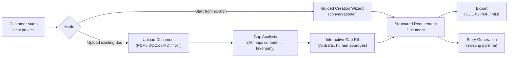
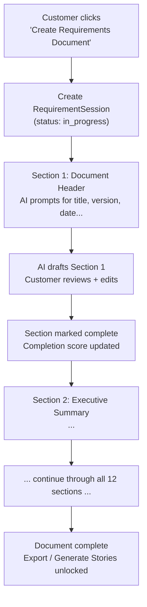
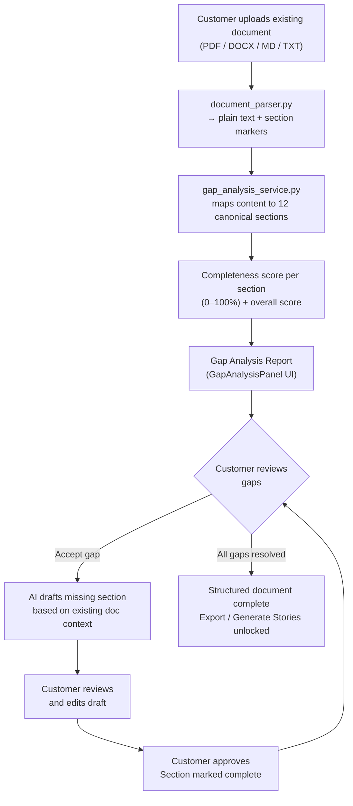

# everapps — Requirements Document Assistant

**Prepared:** March 2026  
**Scope:** An AI-driven assistant that guides customers through creating a well-structured,
industry-standard requirements document — either from scratch via a conversational wizard, or by
uploading an existing document and interactively filling in any missing sections.

---

## Overview

Today everapps accepts any requirements document (PDF, DOCX, MD, TXT), parses it into plain text,
and generates user stories from it. The quality and completeness of that story backlog is
directly tied to the quality of the requirements document it was generated from.

This enhancement introduces a **Requirements Document Assistant** — an AI-powered feature that
ensures every project starts with a well-structured, industry-standard requirements document before
story generation begins. It operates in two modes:

1. **Guided Creation** — a conversational, section-by-section wizard that walks a customer through
   authoring a complete requirements document from scratch. The AI asks targeted questions, drafts
   each section, and keeps the customer informed of overall document completeness.

2. **Gap Analysis & Fill** — the customer uploads an existing document (their current format, any
   fidelity). The AI parses it, maps content to the canonical section taxonomy, identifies missing
   or thin sections, and offers to generate AI-drafted content for each gap. The customer reviews
   and approves each suggestion before it is incorporated.

In both modes the output is a structured, versioned `RequirementDocument` stored in everapps that
downstream story generation can rely on being well-formed and complete.



---

## Industry Standard Framework

### Reference Standards

The canonical section taxonomy implemented by this feature is grounded in three industry
frameworks:

| Standard | Body | Focus |
|---|---|---|
| **ISO/IEC/IEEE 29148:2018** | IEEE | Systems and Software Requirements Specification (SRS); supersedes IEEE 830 |
| **Business Requirements Document (BRD)** | PMI / industry convention | Business context, stakeholders, objectives, success metrics |
| **Product Requirements Document (PRD)** | Product management convention | Feature definitions, user personas, acceptance criteria, prioritization |

No single standard is universally adopted across all project types. everapps synthesises the
strongest elements of each into a single, practical taxonomy that is appropriate for both
waterfall-adjacent and agile software projects.

---

### Canonical Section Taxonomy

The following twelve sections form the baseline structure that every requirements document produced
or validated by everapps must contain. Sections are ordered to reflect the natural flow from
business context → technical requirements → operationalisation.

| # | Section ID | Section Name | Standard Source | Required |
|---|---|---|---|---|
| 1 | `document_header` | Document Header | IEEE 29148 §5.1 | Yes |
| 2 | `executive_summary` | Executive Summary | BRD convention | Yes |
| 3 | `project_context` | Project Context & Business Objectives | BRD / IEEE 29148 §5.2 | Yes |
| 4 | `scope` | Scope | IEEE 29148 §5.2 | Yes |
| 5 | `stakeholders` | Stakeholders & User Personas | BRD / PRD | Yes |
| 6 | `functional_requirements` | Functional Requirements | IEEE 29148 §5.4 | Yes |
| 7 | `non_functional_requirements` | Non-Functional Requirements | IEEE 29148 §5.4 | Yes |
| 8 | `data_requirements` | Data & Integration Requirements | IEEE 29148 §5.4 | Recommended |
| 9 | `constraints` | Constraints & Assumptions | IEEE 29148 §5.3 | Recommended |
| 10 | `success_metrics` | Success Metrics & Acceptance Criteria | BRD / PRD | Recommended |
| 11 | `timeline` | Timeline & Prioritisation | PRD convention | Optional |
| 12 | `glossary` | Glossary | IEEE 29148 §5.1 | Recommended |

**Required** sections must be present and non-empty for a document to be considered complete.
**Recommended** sections contribute to completeness scoring but do not block story generation.
**Optional** sections are surfaced to the customer but do not affect the completeness score.

---

### Section Content Standards

Each section has a defined set of content expectations that the AI uses when evaluating an
uploaded document and when generating fill-in content.

#### 1. Document Header
Minimum fields: document title, version number, date, author(s), approval status
(`draft | in-review | approved`), and a one-line project description.

#### 2. Executive Summary
A 1–3 paragraph narrative covering: the problem being solved, who it is for, and the intended
outcome. Should be intelligible to a non-technical stakeholder.

#### 3. Project Context & Business Objectives
- Business problem statement
- Business objectives (measurable, 3–7 bullet points)
- Current state vs. desired future state
- Alignment to organisational goals

#### 4. Scope
- **In-scope:** explicit list of features, user groups, or system boundaries included
- **Out-of-scope:** explicit list of exclusions (prevents scope creep)
- Integration touchpoints (systems this product connects to)

#### 5. Stakeholders & User Personas
For each stakeholder or user persona:
- Name / role
- Goals and needs
- Pain points
- How they interact with the system

#### 6. Functional Requirements
Organised by domain or feature area. For each requirement:
- Unique requirement ID (e.g. `FR-001`)
- Description using "The system shall…" language (IEEE 29148 convention)
- Priority (`must-have | should-have | nice-to-have` — aligned to MoSCoW)
- Acceptance criteria (Given/When/Then format preferred)

#### 7. Non-Functional Requirements
Organised by category. Minimum coverage expected:

| Category | Examples |
|---|---|
| Performance | Response time, throughput, concurrent users |
| Security | Authentication, authorisation, data encryption, audit logging |
| Scalability | Load scaling approach, data volume limits |
| Reliability | Uptime SLA, recovery time objective (RTO), disaster recovery |
| Usability | Accessibility standard (WCAG 2.1 AA), supported browsers/devices |
| Maintainability | Code standards, test coverage threshold |

#### 8. Data & Integration Requirements
- Key data entities and relationships (informal ERD or table)
- Data retention and deletion policies
- External system integrations (name, protocol, data exchanged)
- Data migration requirements (if applicable)

#### 9. Constraints & Assumptions
- **Constraints:** limitations that cannot change (budget, technology stack, regulatory, timeline)
- **Assumptions:** conditions believed to be true that, if false, would change requirements
- Dependencies on external teams, systems, or decisions

#### 10. Success Metrics & Acceptance Criteria
- Definition of Done for the project as a whole
- Measurable KPIs that define success post-launch
- User acceptance testing (UAT) criteria

#### 11. Timeline & Prioritisation
- High-level milestones with target dates
- MoSCoW or similar prioritisation of feature areas
- Release phasing plan (MVP vs. later releases)

#### 12. Glossary
Domain-specific terms, acronyms, and abbreviations defined for all readers.

---

## Feature Design

### Mode 1 — Guided Creation from Scratch

The Guided Creation wizard walks the customer through authoring each section in order. The AI
acts as an intelligent co-author: it asks targeted questions, drafts content based on the
answers, and lets the customer edit before moving on.

**Session model:** a `RequirementSession` tracks the customer's progress through the twelve
sections within a project. Sessions are persistent — a customer can leave and return to the
same session across multiple browser sessions.



**Wizard interaction pattern per section:**
1. AI presents the section purpose and asks 3–5 targeted questions
2. Customer answers in natural language (free text input)
3. AI drafts the section content in the correct format
4. Customer edits the draft inline
5. Customer marks the section as done; the AI scores it against the content standard
6. If the score is below threshold, the AI flags specific gaps before allowing progression

**Conversational context:** the AI carries context from all previously completed sections
forward into each new section prompt. For example, when drafting functional requirements the
AI already knows the business objectives and stakeholder personas, so its questions and drafts
are contextually grounded.

---

### Mode 2 — Gap Analysis & Fill from Upload

The customer uploads an existing requirements document. The AI maps the parsed content to the
canonical taxonomy and produces a completeness report. The customer can then approve AI-generated
content to fill each identified gap.



**Gap classification:**
- **Missing** — section has no corresponding content in the uploaded document
- **Thin** — section has some content but below the minimum content standard (e.g. functional
  requirements have no acceptance criteria, scope has no explicit out-of-scope list)
- **Present** — section content maps well to the standard; flagged for human confirmation only

The gap analysis does not modify the original uploaded `DocumentVersion`. All AI-generated
fill-in content is stored as new `RequirementSection` records that are merged into a new
`DocumentVersion` only when the customer approves the full document.

---

## Data Models

### New Model — `RequirementSession`

Tracks a guided-creation session's progress through the canonical taxonomy sections. One session
per project (a project resets by creating a new session, preserving the old one).

**File: `backend/app/models/requirement_session.py`**

```python
class RequirementSession(Base):
    __tablename__ = "requirement_sessions"

    id: UUID                   # primary key
    project_id: UUID           # FK → projects.id
    document_id: UUID | None   # FK → requirement_documents.id (set when doc is saved)
    # mode: guided | gap_analysis
    mode: str
    # status: in_progress | complete | abandoned
    status: str
    current_section: str | None   # section_id of the section in progress
    completeness_score: int        # 0–100; recomputed after each section save
    started_at: datetime
    completed_at: datetime | None
    created_at: datetime
    updated_at: datetime
```

---

### New Model — `RequirementSection`

Stores the structured content for one canonical section within a document version. A full
structured document has up to twelve `RequirementSection` rows, one per section ID.

**File: `backend/app/models/requirement_section.py`**

```python
class RequirementSection(Base):
    __tablename__ = "requirement_sections"

    id: UUID                    # primary key
    session_id: UUID            # FK → requirement_sessions.id
    document_version_id: UUID | None  # FK → document_versions.id (set on export/save)
    # section_type: document_header | executive_summary | project_context | scope |
    #               stakeholders | functional_requirements | non_functional_requirements |
    #               data_requirements | constraints | success_metrics | timeline | glossary
    section_type: str
    content: str                # markdown text of the section content
    # source: human | ai_draft | ai_gap_fill | imported
    source: str
    # status: pending | in_progress | complete | skipped
    status: str
    completeness_score: int     # 0–100; AI-evaluated against section content standard
    ai_feedback: str | None     # AI's notes on gaps or improvements for this section
    is_ai_generated: bool
    approved_at: datetime | None
    created_at: datetime
    updated_at: datetime
```

---

### New Model — `RequirementItem`

Individual, uniquely identified requirements within the `functional_requirements` and
`non_functional_requirements` sections. Stored as structured rows to enable traceability
to generated stories.

**File: `backend/app/models/requirement_section.py`** (same file as `RequirementSection`)

```python
class RequirementItem(Base):
    __tablename__ = "requirement_items"

    id: UUID                    # primary key
    section_id: UUID            # FK → requirement_sections.id
    req_id: str                 # e.g. "FR-001", "NFR-SEC-001"
    description: str            # "The system shall…" statement
    # priority: must-have | should-have | nice-to-have | out-of-scope
    priority: str
    acceptance_criteria: str | None   # Given/When/Then format
    # source: human | ai_generated
    source: str
    story_ids: list[UUID]       # FK references → stories.id (populated after story generation)
    created_at: datetime
    updated_at: datetime
```

> **Note:** `story_ids` enables bidirectional traceability: from a requirement item back to
> the generated stories, and from a story forward to the originating requirement. This supports
> impact analysis when a requirement changes after stories are already in progress.

---

### Extended Model — `RequirementDocument`

The existing `RequirementDocument` model gains one new field to link a completed structured
session to the document:

**File: `backend/app/models/document.py`** (existing file, additive migration)

```python
# New column added via Alembic migration
active_session_id: UUID | None   # FK → requirement_sessions.id
```

---

## Services

### New Service — `requirement_template_service.py`

Owns the canonical section taxonomy definition. Returns the ordered list of sections with
their metadata (section ID, display name, required flag, content standard description,
example prompt questions). This is the single source of truth for section ordering and
classification; it drives both the wizard UI and the gap analysis scoring.

**File: `backend/app/services/requirement_template_service.py`**

```python
class RequirementTemplateService:
    def get_taxonomy(self) -> list[SectionTemplate]:
        """Returns all 12 canonical sections in order with metadata."""

    def get_section(self, section_type: str) -> SectionTemplate:
        """Returns metadata for one section by its section_type ID."""

    def get_required_sections(self) -> list[SectionTemplate]:
        """Returns only the sections marked required=True."""

    def score_section_content(
        self, section_type: str, content: str
    ) -> SectionScore:
        """
        Evaluates a section's content against its content standard.
        Returns score (0–100) and a list of specific gaps found.
        Uses LLM for semantic evaluation; rule-based for structural checks
        (e.g. presence of req IDs, Given/When/Then in acceptance criteria).
        """
```

---

### New Service — `requirement_assistant_service.py`

Drives the guided creation conversation. Responsible for generating the AI questions for each
section, drafting section content from the customer's answers, and advancing session state.

**File: `backend/app/services/requirement_assistant_service.py`**

```python
class RequirementAssistantService:
    async def start_session(
        self, project_id: UUID, mode: str, db: Session
    ) -> RequirementSession:
        """Creates a new RequirementSession and returns the first section prompt."""

    async def get_section_prompt(
        self, session: RequirementSession, section_type: str, db: Session
    ) -> AssistantPrompt:
        """
        Generates the opening questions for the given section.
        Injects context from all previously completed sections so questions
        are grounded in what the customer has already provided.
        """

    async def draft_section(
        self,
        session: RequirementSession,
        section_type: str,
        customer_answers: str,
        db: Session,
    ) -> RequirementSection:
        """
        Calls the project's configured LLM to draft section content from
        the customer's free-text answers. Formats output per section standard
        (e.g. req IDs, MoSCoW labels, Given/When/Then acceptance criteria).
        Scores the draft via RequirementTemplateService.score_section_content.
        """

    async def advance_session(
        self, session: RequirementSession, db: Session
    ) -> str | None:
        """
        Marks the current section complete and returns the next section_type
        to work on, or None if all required sections are complete.
        Recomputes overall completeness_score on the session.
        """

    async def save_document(
        self, session: RequirementSession, db: Session
    ) -> RequirementDocument:
        """
        Serialises all completed RequirementSection records into a single
        markdown document, saves it as a new DocumentVersion, and links the
        document back to the session via RequirementDocument.active_session_id.
        """
```

---

### New Service — `gap_analysis_service.py`

Analyses a parsed document against the canonical taxonomy and produces a per-section
completeness report with AI-drafted fill-in content for each gap.

**File: `backend/app/services/gap_analysis_service.py`**

```python
class GapAnalysisService:
    async def analyse(
        self,
        document_version: DocumentVersion,
        session: RequirementSession,
        db: Session,
    ) -> GapAnalysisReport:
        """
        1. Chunks the parsed document text (reuses chunker.py infrastructure).
        2. Calls LLM with all chunks to map each passage to a canonical section_type.
        3. For each of the 12 sections, aggregates mapped passages and scores them
           via RequirementTemplateService.score_section_content.
        4. Creates RequirementSection records for each mapped section.
        5. Returns a GapAnalysisReport listing section status and scores.
        """

    async def draft_gap_fill(
        self,
        session: RequirementSession,
        section_type: str,
        db: Session,
    ) -> RequirementSection:
        """
        Generates AI-drafted content for a missing or thin section.
        Uses context from all other sections (existing and already-filled)
        to produce contextually grounded content.
        Sets source='ai_gap_fill' and status='in_progress' (pending human approval).
        """

    async def approve_section(
        self,
        section: RequirementSection,
        edited_content: str,
        db: Session,
    ) -> RequirementSection:
        """
        Saves the customer-edited content, sets status='complete',
        records approved_at, and recomputes session completeness_score.
        """
```

---

## API Endpoints

### New Router — `requirement_assistant.py`

**File: `backend/app/routers/requirement_assistant.py`**  
**Prefix:** `/api/v1/req-assistant`

| Method | Path | Description |
|---|---|---|
| `POST` | `/{project_id}/session` | Start a new guided-creation or gap-analysis session |
| `GET` | `/{project_id}/session` | Get current session state and completeness score |
| `GET` | `/{project_id}/session/section/{section_type}` | Get AI prompt questions for a section |
| `POST` | `/{project_id}/session/section/{section_type}/draft` | Submit answers; receive AI draft |
| `PUT` | `/{project_id}/session/section/{section_type}` | Save edited section content |
| `POST` | `/{project_id}/session/section/{section_type}/approve` | Mark section complete |
| `POST` | `/{project_id}/session/advance` | Move to next section; returns next section_type |
| `POST` | `/{project_id}/session/save-document` | Serialise session into a `RequirementDocument` |
| `POST` | `/{project_id}/gap-analysis` | Run gap analysis on an already-uploaded document |
| `GET` | `/{project_id}/gap-analysis/report` | Retrieve the latest gap analysis report |
| `POST` | `/{project_id}/gap-analysis/section/{section_type}/fill` | Request AI draft for a gap |
| `PUT` | `/{project_id}/gap-analysis/section/{section_type}` | Save edited gap-fill content |
| `POST` | `/{project_id}/gap-analysis/section/{section_type}/approve` | Approve gap fill |
| `GET` | `/{project_id}/taxonomy` | Return the canonical section taxonomy (for UI rendering) |

**Request/response schemas** defined in `backend/app/schemas/requirement_assistant.py`:

```python
class StartSessionRequest(BaseModel):
    mode: Literal["guided", "gap_analysis"]
    document_id: uuid.UUID | None = None   # required when mode="gap_analysis"

class SectionDraftRequest(BaseModel):
    customer_answers: str   # free-text answers to the section's prompt questions

class SectionSaveRequest(BaseModel):
    content: str   # final markdown content for the section

class GapAnalysisReport(BaseModel):
    session_id: uuid.UUID
    overall_score: int
    sections: list[SectionStatus]

class SectionStatus(BaseModel):
    section_type: str
    display_name: str
    required: bool
    # gap_status: missing | thin | present
    gap_status: str
    completeness_score: int
    ai_feedback: str | None
```

---

## Frontend Components

### Page — Requirement Assistant Entry Point

**File: `frontend/src/app/(dashboard)/projects/[id]/requirements/page.tsx`**

Entry point integrated into the existing project navigation. Displays two call-to-action cards:
- "Create Requirements Document" → starts a guided session
- "Analyse Existing Document" → uses the already-uploaded document to start gap analysis (or
  prompts for upload if none exists)

Shows current session state (completeness score, sections completed vs. remaining) if a session
is in progress for this project.

---

### Component — `RequirementAssistantWizard`

**File: `frontend/src/components/requirements/RequirementAssistantWizard.tsx`**

The guided creation UI. Structured as a vertical stepper where each step corresponds to one
canonical section.

- Left sidebar: section list with completion indicators (pending / in-progress / complete)
- Main panel: current section's AI-generated questions, free-text answer input, AI-drafted
  content preview, inline editor
- Progress bar: overall document completeness score (0–100%)
- "Next Section" button advances after the section is marked complete
- AI feedback badge highlights specific gaps when a section scores below 80%

---

### Component — `GapAnalysisPanel`

**File: `frontend/src/components/requirements/GapAnalysisPanel.tsx`**

Displayed after gap analysis completes on an uploaded document.

- **Left column:** taxonomy checklist — each of the 12 sections with a status badge
  (Missing / Thin / Present) and completeness score
- **Right column:** content panel — shows the AI-mapped content for the selected section;
  for Missing/Thin sections shows the AI-drafted fill-in with an editable text area
- **Section action bar:** "Accept AI Draft" / "Edit & Accept" / "Skip (mark optional)"
- **Overall score ring:** visual indicator of total document completeness
- When all required sections are resolved: "Save Complete Document" button becomes active

---

### Component — `StructuredDocumentEditor`

**File: `frontend/src/components/requirements/StructuredDocumentEditor.tsx`**

A full-document view of the completed requirements document. Rendered as a rich markdown editor
(section-by-section) with:

- Table of contents with anchor links
- Per-section "Re-generate with AI" action to regenerate any section without losing others
- Requirement item table for functional and non-functional sections (editable rows with
  req ID, description, priority, acceptance criteria)
- Export actions: DOCX, PDF, Markdown

---

### Component — `RequirementCompleteness` (shared widget)

**File: `frontend/src/components/requirements/RequirementCompleteness.tsx`**

A reusable completeness indicator shown on the project page and within the wizard. Renders a
progress ring with the overall score and a breakdown list of required sections that are still
incomplete. Links directly to the relevant section in the wizard or gap analysis panel.

---

## Alembic Migrations

Three new migrations in dependency order (each builds on the previous):

```
Migration 1: requirement_sessions
  - Creates requirement_sessions table
  - FK → projects.id

Migration 2: requirement_sections + requirement_items
  - Creates requirement_sections table (FK → requirement_sessions.id, document_versions.id)
  - Creates requirement_items table (FK → requirement_sections.id)

Migration 3: requirement_documents — add active_session_id
  - Adds active_session_id column to requirement_documents (nullable FK → requirement_sessions.id)
```

---

## Phased Delivery

### Phase 1 — Gap Analysis (Read-Only Report)

Deliver gap analysis as a read-only completeness report on uploaded documents. No guided wizard.
Goal: immediate value, minimal new UX.

- `gap_analysis_service.py` — section mapping + scoring (LLM)
- `GapAnalysisPanel` — taxonomy checklist + completeness scores (display only; no fill-in yet)
- `RequirementCompleteness` widget — shown on the existing project page after any document upload
- New `/gap-analysis` endpoints only; no session management

**Prerequisite:** none beyond the existing document upload pipeline.

---

### Phase 2 — Interactive Gap Fill

Extend Phase 1 so the customer can request AI-drafted content for each missing or thin section
and approve it into the document.

- `draft_gap_fill` and `approve_section` service methods
- Editable content panel in `GapAnalysisPanel`
- `RequirementSession` model (gap-analysis mode)
- `save-document` endpoint to serialise approved sections into a new `DocumentVersion`

**Prerequisite:** Phase 1 complete.

---

### Phase 3 — Guided Creation Wizard

Full conversational wizard for creating a requirements document from scratch.

- `requirement_assistant_service.py` — prompt generation, section drafting, session advancement
- `RequirementAssistantWizard` UI component
- Guided-mode session endpoints
- Conversational context injection (prior sections carried into each new section prompt)

**Prerequisite:** Phase 2 complete (shares session model and section storage).

---

### Phase 4 — Structured Export & Traceability

Rich export and requirement-to-story traceability.

- `StructuredDocumentEditor` component
- DOCX export via `python-docx` with proper heading styles and table formatting
- PDF export via `weasyprint` or equivalent
- `RequirementItem` rows created during structured editing; `story_ids` field populated
  when stories are generated from a structured document
- Traceability view: requirement → story mapping in the story backlog UI

**Prerequisite:** Phase 3 complete.

---

## New Files Summary

### Backend Models

| File | Models |
|---|---|
| `backend/app/models/requirement_session.py` | `RequirementSession` |
| `backend/app/models/requirement_section.py` | `RequirementSection`, `RequirementItem` |
| `backend/app/models/document.py` | Extended: `active_session_id` column |

### Backend Services

| File | Responsibility |
|---|---|
| `backend/app/services/requirement_template_service.py` | Canonical taxonomy definition; section scoring |
| `backend/app/services/requirement_assistant_service.py` | Guided creation conversation; section drafting |
| `backend/app/services/gap_analysis_service.py` | Uploaded doc → section mapping; gap fill drafting |

### Backend Schemas

| File | Schemas |
|---|---|
| `backend/app/schemas/requirement_assistant.py` | Session, section, gap analysis request/response types |

### Backend Routers

| File | Endpoints |
|---|---|
| `backend/app/routers/requirement_assistant.py` | All `/api/v1/req-assistant/` endpoints |

### Alembic Migrations

| File | Purpose |
|---|---|
| `backend/alembic/versions/XXX_add_requirement_sessions.py` | `requirement_sessions` table |
| `backend/alembic/versions/XXX_add_requirement_sections.py` | `requirement_sections` + `requirement_items` tables |
| `backend/alembic/versions/XXX_add_document_active_session.py` | `active_session_id` on `requirement_documents` |

### Frontend Components

| Component | Purpose |
|---|---|
| `frontend/src/app/(dashboard)/projects/[id]/requirements/page.tsx` | Requirements assistant entry point |
| `frontend/src/components/requirements/RequirementAssistantWizard.tsx` | Guided creation stepper UI |
| `frontend/src/components/requirements/GapAnalysisPanel.tsx` | Gap analysis report + fill-in UI |
| `frontend/src/components/requirements/StructuredDocumentEditor.tsx` | Full-document editor + export |
| `frontend/src/components/requirements/RequirementCompleteness.tsx` | Shared completeness widget |

---

## Open Decisions

| Decision | Options | Status |
|---|---|---|
| Storage format for `RequirementSection.content` | Plain markdown string (current plan) vs. structured JSON (AST-like) for richer programmatic manipulation | Not decided |
| Template configurability | Global canonical template only vs. per-project overrides (add/remove/reorder sections) | Not decided — start global, evaluate per-project demand |
| Gap analysis LLM strategy | Single large prompt with full doc (simpler, risk of context overflow) vs. multi-pass chunked (reuses `chunker.py`, more robust for large docs) | Not decided — Phase 1 spike needed |
| Export format priority | DOCX (python-docx) first vs. PDF (weasyprint) first vs. Markdown only for Phase 4 | Not decided |
| `RequirementItem` creation timing | Auto-created from AI draft during wizard vs. only when customer explicitly opens structured editor | Not decided |
| Session abandonment policy | Whether old sessions are archived or deleted when a new session is started for the same project | Not decided |

---

*Document generated for the everapps project · March 2026*
